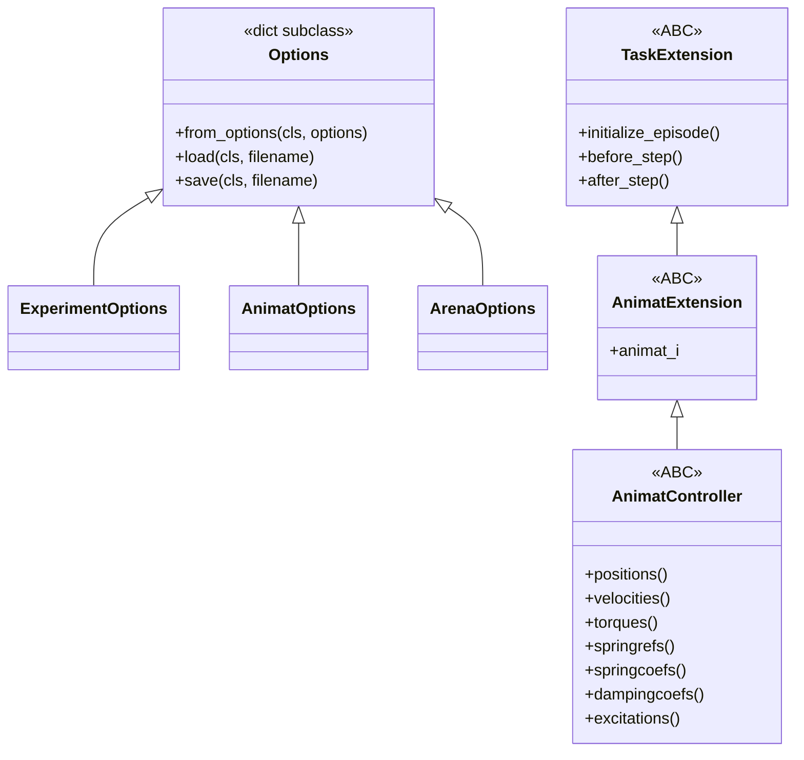
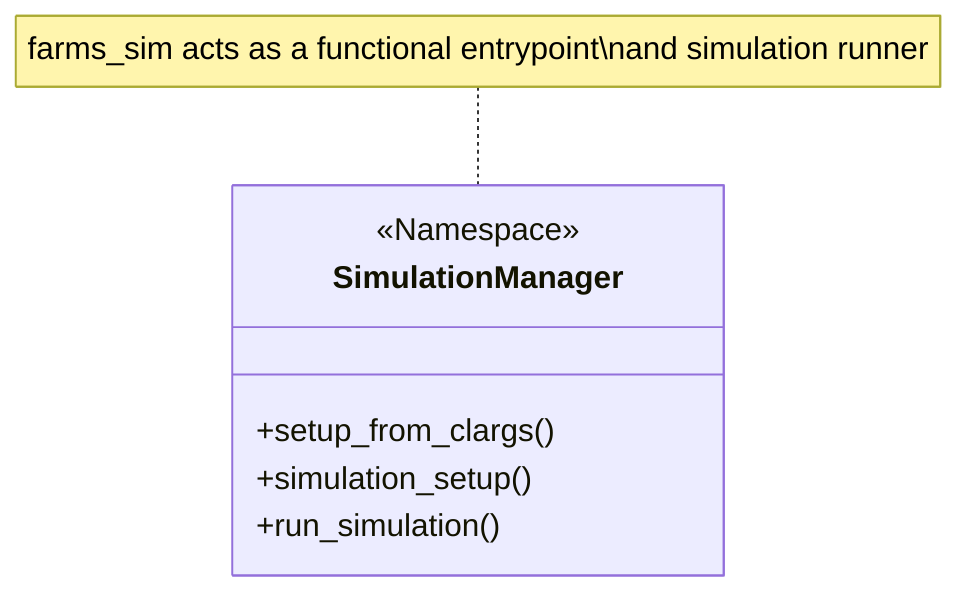
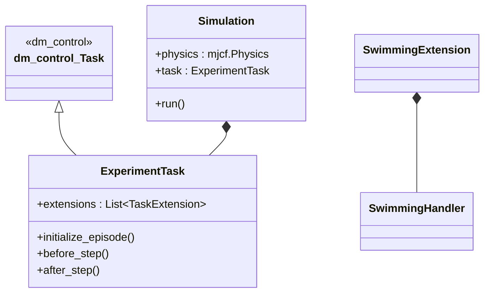
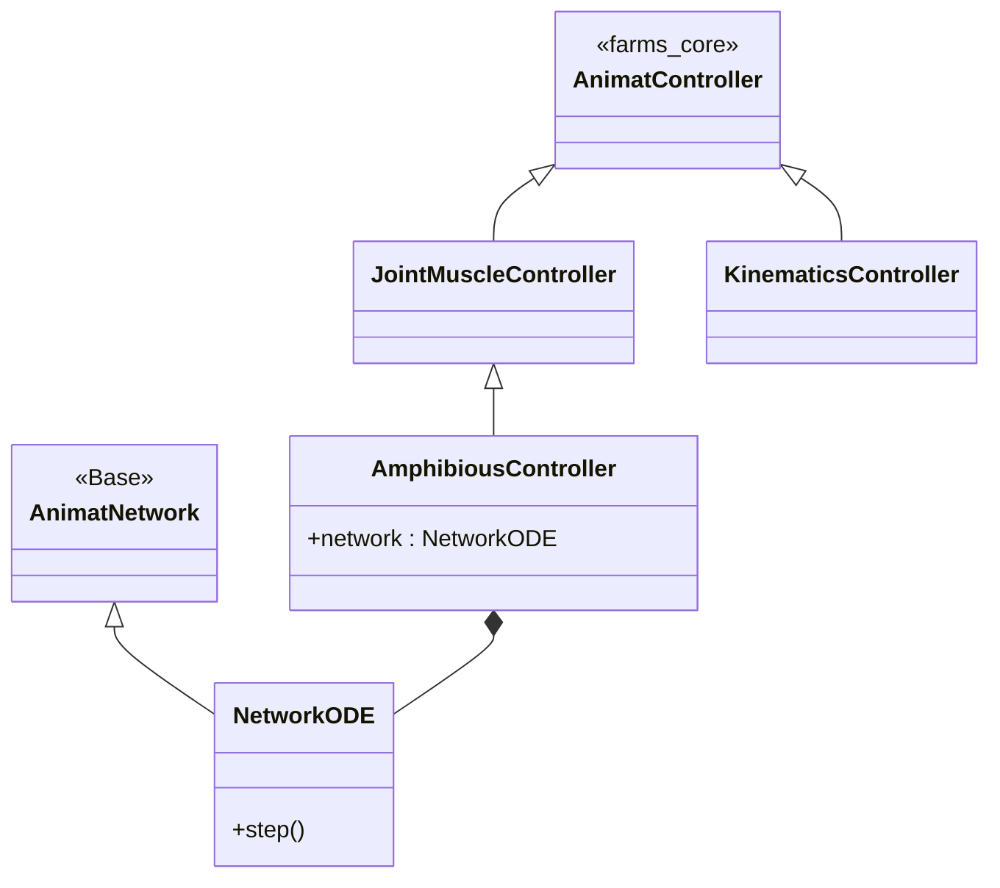
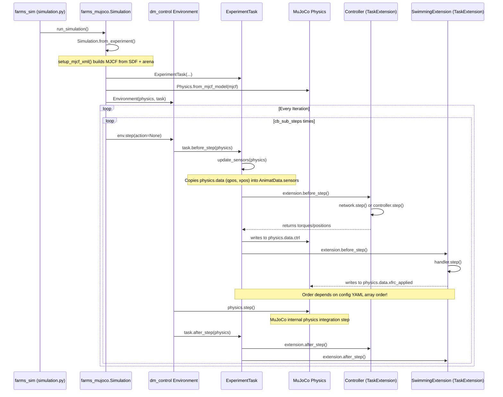

# Architecture & Data Flow

This document details the cross-module dependencies and execution loop of the FARMS framework.

## Cross-Module Data Flow

The following data flow diagram illustrates how `farms_core` data structures flow into `farms_sim`, are consumed by the execution loop in `farms_mujoco`, and how `farms_amphibious` and hydrodynamics hook into this loop.

```mermaid
flowchart TD
    subgraph farms_core ["farms_core (Data Structures & Interfaces)"]
        EO[ExperimentOptions] -->|contains| AO[AnimatOptions]
        EO -->|contains| ArO[ArenaOptions]
        ED[ExperimentData] -->|contains| AD[AnimatData]
    end

    subgraph farms_sim ["farms_sim (Simulation Manager)"]
        FS_Sim["simulation.py: setup_from_clargs / run_simulation"]
        FS_Sim -->|loads| EO
        FS_Sim -->|initializes| ED
    end

    subgraph farms_mujoco ["farms_mujoco (Physics Backend)"]
        FM_Sim[Simulation.from_experiment]
        Task[ExperimentTask]
        Physics["dm_control Physics"]
        Env["dm_control Environment"]
        FM_Sim -->|creates| Task
        FM_Sim -->|creates| Physics
        FM_Sim -->|creates| Env
        Task -->|"reads/writes state"| ED
    end

    subgraph farms_amphibious ["farms_amphibious (Domain Control)"]
        AC["AmphibiousController / ZbotCPGController"]
        AC -.->|implements| TaskExtension[TaskExtension]
        AC -->|"computes torques/positions"| Task
    end

    subgraph Hydrodynamics ["farms_mujoco.swimming (Domain Physics)"]
        SE[SwimmingExtension]
        SH[SwimmingHandler]
        SE -.->|implements| TaskExtension
        SE -->|uses| SH
        SH -->|"applies xfrc_applied"| Physics
    end

    FS_Sim -->|creates| FM_Sim
    Task -->|"calls before_step()"| AC
    Task -->|"calls before_step()"| SE
```

## Class & Inheritance Diagrams

### `farms_core`

### `farms_sim`

### `farms_mujoco`

### `farms_amphibious`

## Execution Loop Reconstruction

The FARMS execution loop involves coordination between `farms_sim` (orchestration), `farms_mujoco` (task definitions), `dm_control` (RL environment loop), and `farms_amphibious` (forces/control).

## Potential Fragility in Order-of-Operations

1. **Extension Ordering**: `Task.extensions` is populated by concatenating `simulation.extensions` and `animat.extensions` arrays from the user's YAML config (`ExperimentTask.extract_extensions`). `ExperimentTask` iterates this array sequentially. If the `SwimmingExtension` (hydrodynamics) is listed before the controller, the hydrodynamics model computes forces based on the *previous* step's positions/velocities before the controller actuates the joints.

2. **Buffer Overwrites**: `update_sensors()` writes into `AnimatData.sensors` using modulo arithmetic `index = task.iteration % buffer_size`. If an extension processes history longer than `buffer_size`, it will encounter overwritten data.