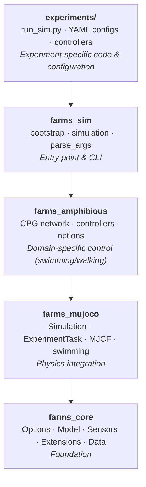

# System Architecture

FARMS is built as a layered Python framework for physics-based robot simulation
with a focus on undulatory swimming locomotion.

## Package layers



**farms_core** provides the abstract interfaces: `Options` (YAML
serialization), `AnimatExtension` / `TaskExtension` (lifecycle hooks),
`AnimatController` (joint target interface), and `ExperimentData` (data
persistence).

**farms_mujoco** implements the physics layer: converts SDF models to MuJoCo
XML, runs the dm_control task loop, computes hydrodynamic forces, and provides
visualization extensions.

**farms_amphibious** provides the CPG locomotion control system: oscillator
networks, descending drives, sensory feedback connectivity, and multiple muscle
equations (phase, Ekeberg, passive).

**farms_sim** is a thin entry point: CLI argument parsing, experiment directory
resolution, and delegation to the simulation backend.

**experiments/** contain the concrete robot definitions: SDF models, YAML
configs, and custom controllers.

## Key design principles

### YAML-driven configuration

All simulation parameters are defined in YAML files. The `Options` base class
(a `dict` subclass) handles serialization via `yaml2pyobject()` /
`pyobject2yaml()`. Dotted Python paths (`loader` fields) allow flexible class
resolution — you can substitute any `Options` subclass without changing the
loading code.

### Extension-based extensibility

Instead of deep inheritance hierarchies, FARMS uses composition via extensions.
Any per-step behavior — logging, force computation, visualization, control — is
implemented as an extension that hooks into the `before_step()` / `after_step()`
lifecycle. This allows mixing and matching behaviors without modifying core
code.

### dm_control integration

The MuJoCo integration is built on Google's [dm_control](https://github.com/deepmind/dm_control)
framework. `ExperimentTask` extends dm_control's `Task` class, and the
simulation runs inside a dm_control `Environment`. This provides access to
MuJoCo's physics engine while maintaining a clean task/physics separation.

### Pre-allocated data arrays

All sensor data, network states, and timing are pre-allocated as NumPy arrays
at simulation setup time (`ExperimentData.from_options()`). This avoids
dynamic memory allocation during the simulation loop and enables efficient
HDF5 serialization.

## Data flow

```
YAML configs → ExperimentOptions → ExperimentData (pre-allocated)
                                     ↓
                              MuJoCoSimulation.from_experiment()
                                     ↓
                              ExperimentTask (dm_control Task)
                                     ↓
                    ┌──── env.step() loop ────┐
                    │  before_step():          │
                    │    update_sensors()      │
                    │    extensions.before()   │
                    │    controller outputs    │
                    │  physics.step()          │
                    │  after_step():           │
                    │    extensions.after()     │
                    └─────────────────────────┘
                                     ↓
                        ExperimentData → HDF5
```

## See also

- [Architecture Diagrams and Data Flow](architecture-diagrams.md) — class/inheritance
  diagrams per package, the reconstructed execution loop, and known
  order-of-operations fragility notes (deeper dive than this page)
- [Simulation Lifecycle](simulation-lifecycle.md) — detailed step-by-step flow
- [Options and YAML Design](options-yaml-design.md) — serialization mechanism
- [Extension and Controller Design](extension-design.md) — lifecycle hooks
