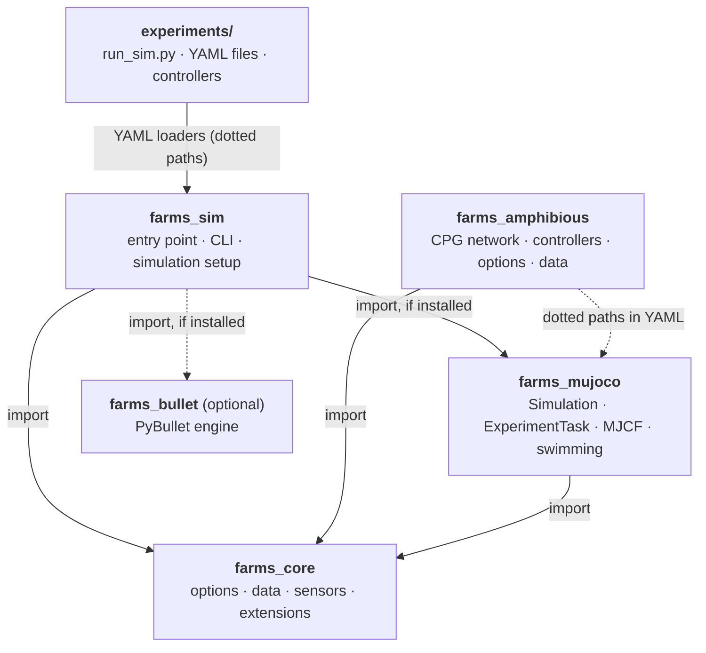
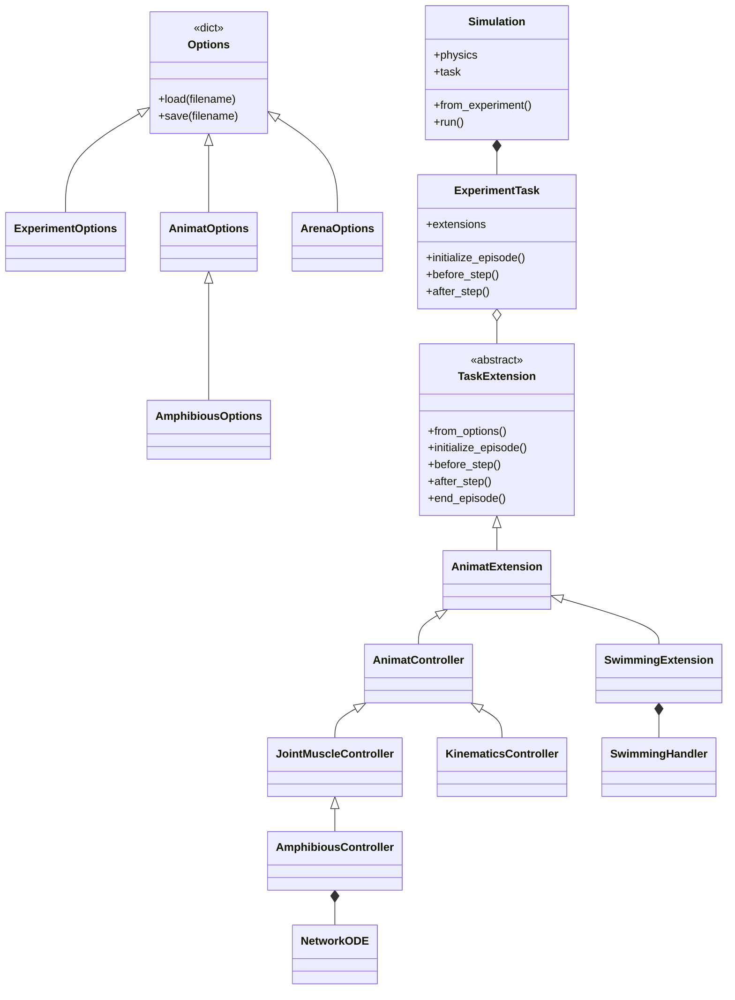
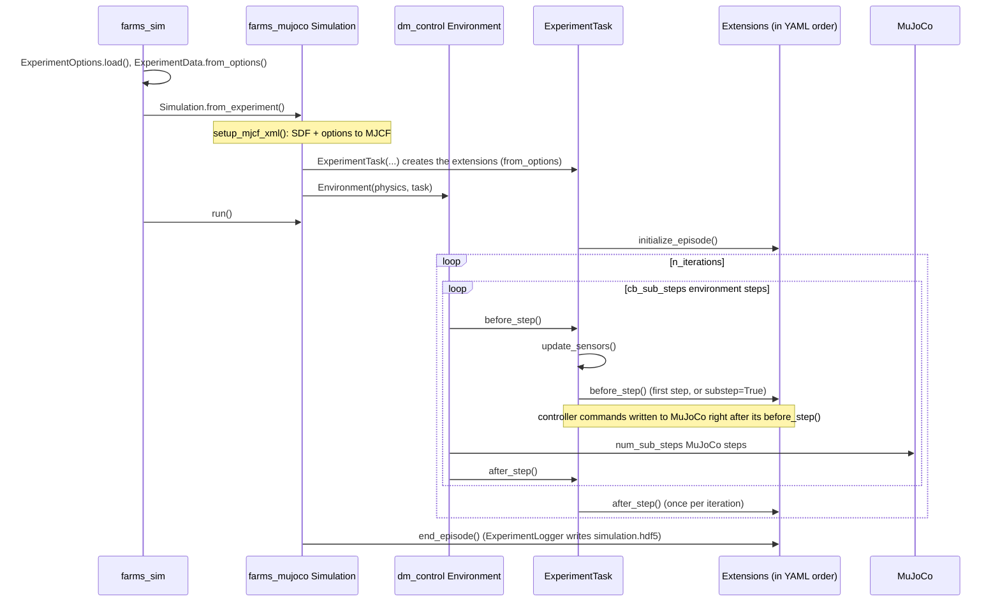

# System Architecture

FARMS is a set of Python packages for physics-based simulation of animals
and robots, used here for undulatory swimming. This page describes how the
packages depend on each other, the main classes, and the execution of a
simulation. [Trace a Simulation Step](../tutorials/simulation-workflow.md)
follows the same path with the code of each step.

## Package layers

```mermaid
flowchart TB
    EXP["<b>experiments/</b><br/>run_sim.py · YAML files · controllers"]
    SIM["<b>farms_sim</b><br/>entry point · CLI · simulation setup"]
    AMPH["<b>farms_amphibious</b><br/>CPG network · controllers · options · data"]
    MUJ["<b>farms_mujoco</b><br/>Simulation · ExperimentTask · MJCF · swimming"]
    BULLET["<b>farms_bullet</b> (optional)<br/>PyBullet engine"]
    CORE["<b>farms_core</b><br/>options · data · sensors · extensions"]

    EXP -->|"YAML loaders (dotted paths)"| SIM
    SIM -->|import| CORE
    SIM -->|"import, if installed"| MUJ
    SIM -.->|"import, if installed"| BULLET
    AMPH -->|import| CORE
    MUJ -->|import| CORE
    AMPH -.->|"dotted paths in YAML"| MUJ
```

- **farms_core** is the foundation that every package imports: the
  `Options` classes (YAML files), `ExperimentData` and `AnimatData`
  (pre-allocated arrays, HDF5 files), the sensor arrays, and the
  extension base classes (`TaskExtension`, `AnimatExtension`,
  `AnimatController`).
- **farms_mujoco** is the MuJoCo engine: it converts the SDF models into a
  MuJoCo model, runs the dm_control task, computes the fluid forces and
  provides the viewer and recording extensions.
- **farms_amphibious** is the locomotion control: CPG networks, descending
  drives, sensory feedback and joint equations (position, Ekeberg,
  passive), with its options (`AmphibiousOptions`) and data
  (`AmphibiousData`). Its control code does not import `farms_mujoco`.
- **farms_sim** is the entry point: command line, loading of the options
  and data, and creation of the simulation of the chosen engine. It imports
  `farms_mujoco` (and `farms_bullet`) when installed, and fails if neither
  is.
- **experiments/** hold the concrete experiments: YAML files, SDF models
  (in `models/`) and custom controllers.

The classes of a given experiment are chosen by the dotted paths of its
YAML files, and imported at runtime by
`farms_core.extensions.extensions.import_item()`:

| YAML file | Key | Zbot value | Chooses |
|-----------|-----|-----------|---------|
| `experiment_config.yaml` | `loaders.animats_options` | `farms_amphibious.model.options.AmphibiousOptions` | The class that reads the animat file |
| `experiment_config.yaml` | `loaders.arenas_options` | `farms_amphibious.model.options.AmphibiousArenaOptions` | The class that reads the arena file |
| `experiment_config.yaml` | `loaders.experiment_data`, `loaders.animats_data` | `farms_core.experiment.data.ExperimentData`, `farms_core.model.data.AnimatData` (or the `farms_amphibious.data.data` classes) | The data arrays |
| `animat_config.yaml` | `extensions[*].loader` | A controller and `farms_mujoco.swimming.extension.SwimmingExtension` | The controller and the fluid forces |
| `simulation_config.yaml` | `extensions[*].loader` | Loggers, viewer extensions | Simulation extensions |

The engine is chosen by the `--simulator` option of the command line
(`MUJOCO` by default).

!!! note "Broken optional module"
    `farms_amphibious/callbacks.py` imports a `callback` module of
    `farms_mujoco.swimming` that no longer exists. It is only
    used by `farms_amphibious/scripts/amphibious.py`, not by the
    experiments.

## Design principles

**YAML configuration.** Every parameter is in a YAML file, read into
`Options` classes (`dict` subclasses with attribute access). See
[Options and YAML Design](options-yaml-design.md).

**Extensions.** Every per-step behaviour (control, forces, logging,
visualisation) is an extension called by the task. See
[Extension and Controller Design](extension-design.md).

**dm_control.** `ExperimentTask` is a dm_control `Task`, run in a
dm_control `Environment`, which separates the task from the physics and
gives an RL-ready interface.

**Pre-allocated arrays.** All sensor data, network states and times are
NumPy arrays allocated before the simulation (`ExperimentData.from_options()`),
so the loop does not allocate and the arrays can be saved to HDF5 as is.
See [Data Flow and Persistence](data-flow.md).

## Main classes

```mermaid
classDiagram
    class Options {
        <<dict>>
        +load(filename)
        +save(filename)
    }
    Options <|-- ExperimentOptions
    Options <|-- AnimatOptions
    Options <|-- ArenaOptions
    AnimatOptions <|-- AmphibiousOptions

    class TaskExtension {
        <<abstract>>
        +from_options()
        +initialize_episode()
        +before_step()
        +after_step()
        +end_episode()
    }
    TaskExtension <|-- AnimatExtension
    AnimatExtension <|-- AnimatController
    AnimatExtension <|-- SwimmingExtension
    AnimatController <|-- JointMuscleController
    JointMuscleController <|-- AmphibiousController
    AnimatController <|-- KinematicsController

    class ExperimentTask {
        +extensions
        +initialize_episode()
        +before_step()
        +after_step()
    }
    class Simulation {
        +physics
        +task
        +from_experiment()
        +run()
    }
    Simulation *-- ExperimentTask
    ExperimentTask o-- TaskExtension
    SwimmingExtension *-- SwimmingHandler
    AmphibiousController *-- NetworkODE
```

## Execution

```mermaid
sequenceDiagram
    participant Sim as farms_sim
    participant MS as farms_mujoco Simulation
    participant Env as dm_control Environment
    participant Task as ExperimentTask
    participant Ext as Extensions (in YAML order)
    participant MJ as MuJoCo

    Sim->>Sim: ExperimentOptions.load(), ExperimentData.from_options()
    Sim->>MS: Simulation.from_experiment()
    Note over MS: setup_mjcf_xml(): SDF + options to MJCF
    MS->>Task: ExperimentTask(...) creates the extensions (from_options)
    MS->>Env: Environment(physics, task)
    Sim->>MS: run()
    Task->>Ext: initialize_episode()
    loop n_iterations
        loop cb_sub_steps environment steps
            Env->>Task: before_step()
            Task->>Task: update_sensors()
            Task->>Ext: before_step() (first step, or substep=True)
            Note over Task,Ext: controller commands written to MuJoCo right after its before_step()
            Env->>MJ: num_sub_steps MuJoCo steps
            Env->>Task: after_step()
        end
        Task->>Ext: after_step() (once per iteration)
    end
    MS->>Ext: end_episode() (ExperimentLogger writes simulation.hdf5)
```

1. **Parsing.** `farms_sim` parses the command line and loads the options
   with `ExperimentOptions.load()`, which reads each file with the class
   of `loaders:`.
2. **Data.** The data class of `loaders.experiment_data` allocates the
   arrays for `runtime.buffer_size` iterations.
3. **Setup.** `Simulation.from_experiment()` builds the MJCF model, the
   `ExperimentTask` (which creates the extensions) and the dm_control
   environment.
4. **Episode start.** `ExperimentTask.initialize_episode()` builds the
   maps between MuJoCo and the arrays, collects the controllers, resets to
   keyframe 0 and initialises the extensions (`SwimmingExtension` builds
   its `SwimmingHandler` then).
5. **Loop.** At each environment step, the task updates the sensors, runs
   the extensions and writes the controller commands, then MuJoCo steps.
   Extensions write forces to `physics.data.xfrc_applied`.
6. **End.** `end_episode()` is called on the extensions: `ExperimentLogger`
   writes `simulation.hdf5`, and `ExperimentOptionsLogger` has written the
   options at the start.

!!! warning "Sensor buffers"
    The sensor arrays hold `runtime.buffer_size` iterations and are indexed
    with `iteration % buffer_size`. With a buffer shorter than the
    simulation, old iterations are overwritten.

## See also

- [Simulation Lifecycle](simulation-lifecycle.md)
- [Trace a Simulation Step](../tutorials/simulation-workflow.md)
- [Options and YAML Design](options-yaml-design.md)
- [Extension and Controller Design](extension-design.md)
- [Data Flow and Persistence](data-flow.md)
