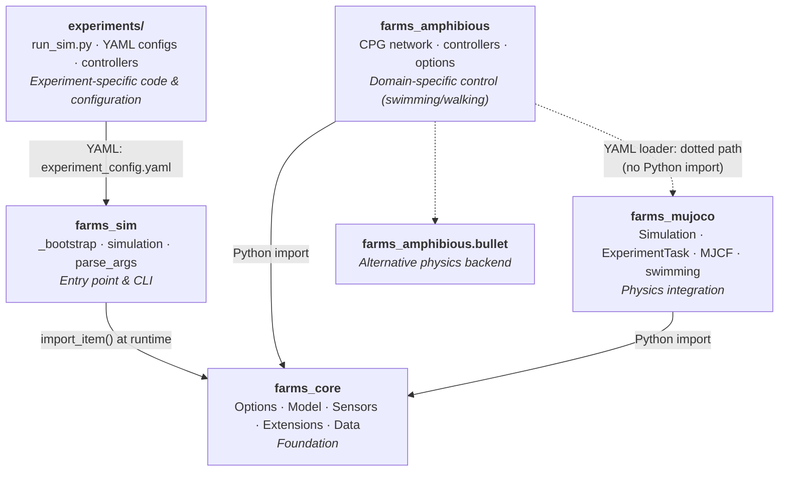
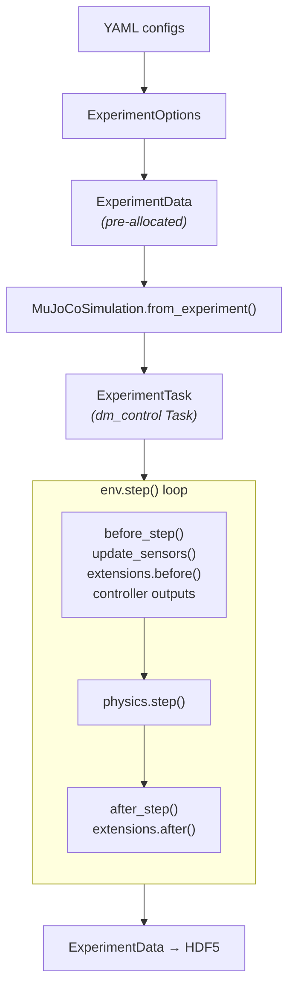

# System Architecture

FARMS is built as a layered Python framework for physics-based robot simulation
with a focus on undulatory swimming locomotion.

## Package layers

```mermaid
flowchart TB
    EXP["<b>experiments/</b><br/>run_sim.py · YAML configs · controllers<br/><i>Experiment-specific code &amp; configuration</i>"]
    SIM["<b>farms_sim</b><br/>_bootstrap · simulation · parse_args<br/><i>Entry point &amp; CLI</i>"]
    AMPH["<b>farms_amphibious</b><br/>CPG network · controllers · options<br/><i>Domain-specific control (swimming/walking)</i>"]
    MUJ["<b>farms_mujoco</b><br/>Simulation · ExperimentTask · MJCF · swimming<br/><i>Physics integration</i>"]
    BULLET["<b>farms_amphibious.bullet</b><br/><i>Alternative physics backend</i>"]
    CORE["<b>farms_core</b><br/>Options · Model · Sensors · Extensions · Data<br/><i>Foundation</i>"]

    EXP -->|"YAML: experiment_config.yaml"| SIM
    SIM -->|"import_item() at runtime"| CORE
    AMPH -->|Python import| CORE
    MUJ -->|Python import| CORE
    AMPH -.->|"YAML loader: dotted path<br/>(no Python import)"| MUJ
    AMPH -.-> BULLET
```

The dependency structure is a **hub-and-spoke**, not a chain:
`farms_core` is the hub every other package imports directly;
`farms_amphibious` and `farms_mujoco` are independent spokes that never
see each other's code (`farms_mujoco` never imports `farms_amphibious`,
and nothing under `farms_amphibious/control/` — the CPG/muscle logic
itself — imports `farms_mujoco`); and the YAML `loaders:`/`loader:`
mechanism is what stitches a specific spoke combination together for one
experiment, entirely at runtime, with zero compile-time coupling between
them. This is *why* `farms_amphibious/bullet/` exists, and why the
loader-injection pattern exists in the first place — it lets one CPG
implementation (`farms_amphibious`) drive either physics backend
(`farms_mujoco` or PyBullet via `farms_amphibious.bullet`) without either
package needing to know the other exists. `farms_sim` itself never
hard-imports `farms_amphibious` or `farms_mujoco` either — only
`farms_core` — and resolves everything else purely through the
dotted-path strings in `loaders:` (`experiment_config.yaml`) via
`farms_core.extensions.extensions.import_item()` at runtime.

The one exception to the "spokes never see each other" rule is
`farms_amphibious/callbacks.py`, which imports
`farms_mujoco.swimming.callback.SwimmingCallback` directly — a thin,
optional wiring helper (used by `farms_amphibious/scripts/amphibious.py`)
for hooking up MuJoCo swimming callbacks. It's not part of the CPG/control/
data core, so it doesn't change the hub-and-spoke picture above.

**farms_core** provides the abstract interfaces: `Options` (YAML
serialization), `AnimatExtension` / `TaskExtension` (lifecycle hooks),
`AnimatController` (joint target interface), and `ExperimentData` (data
persistence).

**farms_mujoco** implements the physics layer: converts SDF models to MuJoCo
XML, runs the dm_control task loop, computes hydrodynamic forces, and provides
visualization extensions.

**farms_amphibious** provides the CPG locomotion control system: oscillator
networks, descending drives, sensory feedback connectivity, and multiple muscle
equations (phase, Ekeberg, passive). It ships two independent physics
backends under its own package (`farms_amphibious.control`/`model`/`data` for
the shared logic, plus a `bullet/` submodule for PyBullet) and is otherwise
physics-agnostic — nothing under `farms_amphibious/control/` imports
`farms_mujoco`.

**farms_sim** is a thin entry point: CLI argument parsing, experiment directory
resolution, and delegation to the simulation backend. It only imports
`farms_core` directly; every other package it touches at runtime
(`farms_amphibious.model.options.AmphibiousOptions`,
`farms_mujoco.simulation.simulation.Simulation`, etc.) arrives exclusively
through dotted-path strings read out of YAML, never a Python `import`
statement naming that package.

**experiments/** contain the concrete robot definitions: SDF models, YAML
configs, and custom controllers.

## How a concrete experiment picks its packages

Nothing in `farms_sim` or `farms_core` decides in code that a Zbot
experiment uses `farms_amphibious` + `farms_mujoco` — that choice is made
entirely by which dotted paths appear in the experiment's own YAML files,
confirmed against `experiments/zbot_swimming/`:

| YAML file | Key | Value | Selects |
|-----------|-----|-------|---------|
| `experiment_config.yaml` | `loaders.animats_options` | `farms_amphibious.model.options.AmphibiousOptions` | The CPG-capable options/data layer (`farms_amphibious`) over the plain `farms_core.model.options.AnimatOptions` |
| `experiment_config.yaml` | `loaders.experiment_data` / `loaders.animats_data` | `farms_amphibious.data.data.Amphibious{Experiment}Data` | Amphibious-specific pre-allocated arrays (oscillator states, drives) alongside the base sensor arrays |
| `animat_config.yaml` | `control.controller_loader` | `farms_amphibious.control.amphibious.AmphibiousController` | The actual CPG controller implementation |
| `animat_config.yaml` | `extensions[*].loader` | `farms_mujoco.swimming.extension.SwimmingExtension` | The MuJoCo-specific hydrodynamics extension — this is the *only* place `farms_mujoco` gets pulled in for the animat; swap this one line for a PyBullet-based extension and the CPG/controller stack above it is untouched |
| `simulation_config.yaml` | `mujoco` block presence + CLI `--simulator MUJOCO` | — | Which `Simulation` subclass `farms_sim` instantiates (`farms_mujoco.simulation.simulation.Simulation` vs. a PyBullet equivalent) |

This is the practical payoff of the hub-and-spoke structure above: switching
physics backends for an amphibious CPG experiment is a small, localized YAML
edit (a handful of `loader:`/`controller_loader:` strings), not a Python
refactor, because the two spokes were never wired together in code to begin
with.

## Key design principles

### YAML-driven configuration

All simulation parameters are defined in YAML files. The `Options` base class
(a `dict` subclass) handles serialization via `yaml2pyobject()` /
`pyobject2yaml()`. Dotted Python paths (`loader` fields) allow flexible class
resolution — you can substitute any `Options` subclass without changing the
loading code.

### Extension-based extensibility

Instead of deep inheritance hierarchies, FARMS uses composition via extensions.
Any per-step behavior — logging, force computation, visualization, control — is
implemented as an extension that hooks into the `before_step()` / `after_step()`
lifecycle. This allows mixing and matching behaviors without modifying core
code.

### dm_control integration

The MuJoCo integration is built on Google's [dm_control](https://github.com/deepmind/dm_control)
framework. `ExperimentTask` extends dm_control's `Task` class, and the
simulation runs inside a dm_control `Environment`. This provides access to
MuJoCo's physics engine while maintaining a clean task/physics separation.

### Pre-allocated data arrays

All sensor data, network states, and timing are pre-allocated as NumPy arrays
at simulation setup time (`ExperimentData.from_options()`). This avoids
dynamic memory allocation during the simulation loop and enables efficient
HDF5 serialization.

## Data flow

```mermaid
flowchart TB
    YAML["YAML configs"] --> OPT["ExperimentOptions"]
    OPT --> DATA["ExperimentData<br/><i>(pre-allocated)</i>"]
    DATA --> SIM["MuJoCoSimulation.from_experiment()"]
    SIM --> TASK["ExperimentTask<br/><i>(dm_control Task)</i>"]
    TASK --> LOOP

    subgraph LOOP["env.step() loop"]
        direction TB
        BEFORE["before_step()<br/>update_sensors()<br/>extensions.before()<br/>controller outputs"]
        PHYS["physics.step()"]
        AFTER["after_step()<br/>extensions.after()"]
        BEFORE --> PHYS --> AFTER
    end

    LOOP --> HDF5["ExperimentData → HDF5"]
```

## See also

- [Architecture Diagrams and Data Flow](architecture-diagrams.md) — class/inheritance
  diagrams per package, the reconstructed execution loop, and known
  order-of-operations fragility notes (deeper dive than this page)
- [Simulation Lifecycle](simulation-lifecycle.md) — detailed step-by-step flow
- [Options and YAML Design](options-yaml-design.md) — serialization mechanism
- [Extension and Controller Design](extension-design.md) — lifecycle hooks
