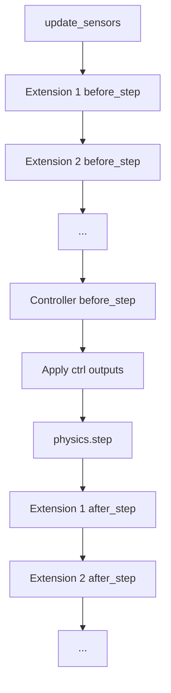

# Simulation Lifecycle

This document traces the complete lifecycle of a FARMS simulation, from
startup to shutdown, showing which methods are called and in what order.

## Phase 1: Startup

```
run_sim.py                     # adds experiment dir to sys.path itself
  → _bootstrap.main()          # NO ARGS — macOS/mjpython re-exec check only
    → farmsim.profile_simulation()
      → farmsim.main()
        → simulation.setup_from_clargs()
        → simulation.run_simulation()
```

!!! warning "Corrected: `_bootstrap.main()` takes no arguments"
    A previous version of this page showed `_bootstrap.main(__file__)`.
    That function signature does not exist — see
    `reference/farms-sim.md` for the verified entry-point chain and why
    this matters (the `sys.path` fix-up happens in `run_sim.py`, not in
    `_bootstrap`). Also note `profile_simulation()` and `main()` live in
    `farms_sim/farmsim.py`, not in `simulation.py` as previously stated.

`farmsim.main()` performs:

1. **Parse arguments and load options** — `setup_from_clargs()` calls
   `sim_parse_args()` for the experiment config path and simulator type,
   then `ExperimentOptions.load(experiment_config_path)`, which reads the
   top-level YAML and resolves `simulation`/`animats`/`arenas` sub-configs
   via the `loaders:` block (see `internals/options-yaml-internals.md`) —
   not a `{loader, config}` pair inline under each key.
2. **Create data** — the experiment-data loader class named in
   `exp_options.loaders.experiment_data` is resolved via `import_item()`
   and called as `.from_options(exp_options)`, pre-allocating the NumPy
   arrays based on simulation duration, timestep, and sensor counts.
3. **Run** — `run_simulation(experiment_data=..., experiment_options=...,
   simulator=...)` calls `simulation_setup()` to create the backend
   (`MuJoCoSimulation.from_experiment()` for MuJoCo) and then `sim.run()`.

## Phase 2: Simulation setup

`MuJoCoSimulation.from_experiment()` performs:

### 2a. MJCF construction

`setup_mjcf_xml()` builds the MuJoCo model:

1. Parse animat SDF files → extract links, joints, visuals, collisions
2. Apply `AnimatOptions.morphology` — link densities, drag coefficients,
   friction, collision flags
3. Apply `AnimatOptions.morphology.joints` — limits, stiffness, damping
4. Parse arena SDF → ground plane, water visuals
5. Apply `ArenaOptions.water` — water height, density (for swimming extension)
6. Create MJCF sensor elements from `SensorsOptions`
7. Compile the MJCF into a dm_control `Physics` model

### 2b. Task creation

`ExperimentTask` is created with references to:

- `experiment_options` — all configuration
- `experiment_data` — pre-allocated arrays
- `physics` — the dm_control Physics object

### 2c. Environment creation

`dm_control.rl.control.Environment(physics, task)` wraps the model and task.

## Phase 3: Episode initialization

`task.initialize_episode(physics)` is called once:

1. **Build maps** — joint name → qpos/qvel indices, link name → body indices,
   sensor name → array indices
2. **Create controllers** — import controller class via
   `animat_options.control.controller_loader`, call `from_options()` with
   config, data, and options
3. **Create extensions** — for each entry in `simulation_config.yaml` and
   `animat_config.yaml` `extensions:` lists:
   - Import class via `import_item(loader)`
   - Call `from_options()` (signature depends on TaskExtension vs
     AnimatExtension)
4. **Initialize extensions** — call `extension.initialize_episode(task, physics)`
   for each extension
5. **Initialize sensor arrays** — set initial values from MuJoCo state

## Phase 4: Main loop

For each iteration `i` from 0 to `n_iterations - 1`:

### before_step()

```
ExperimentTask.before_step(physics)
  │
  ├── update_sensors(i, physics)
  │     Read MuJoCo state → write into AnimatData.sensors arrays
  │
  ├── for extension in extensions:
  │     extension.before_step(task, None, physics)
  │       (controllers advance internal dynamics here)
  │
  ├── Collect controller outputs:
  │     positions = controller.positions(i, time, dt)
  │     velocities = controller.velocities(i, time, dt)
  │     torques = controller.torques(i, time, dt)
  │
  └── Apply outputs to physics.data.ctrl
```

### physics step

dm_control calls `physics.step()` — MuJoCo advances the simulation by one
timestep using the control inputs set in `before_step()`.

### after_step()

```
ExperimentTask.after_step(physics)
  │
  ├── self.iteration += 1
  │
  └── for extension in extensions:
        extension.after_step(task, None, physics)
          (ExperimentLogger records data here)
```

## Phase 5: Shutdown

When the loop completes (or user quits):

1. **`task.end_episode(physics)`** is called
2. Each extension's `end_episode()` is called:
   - `ExperimentLogger` writes HDF5 file
   - `ExperimentOptionsLogger` saves YAML copies
   - `MjcfSaver` saves MJCF XML
3. **Video rendering** (if `--video` was specified)
4. **Plotting** (if `--plot` was specified)

## Interactive vs headless

| Mode | When | Behavior |
|------|------|----------|
| Interactive | Display available | `mujoco.viewer.launch_passive()` with keyboard callbacks |
| Headless | No display | `tqdm` progress bar, no rendering |

In interactive mode, the simulation pauses between steps to allow the viewer
to render. Keyboard callbacks allow pausing and quitting.

## Extension execution order

Extensions are called in YAML declaration order. Within a single step:



This means `SwimmingExtension` (which sets `xfrc_applied`) must be listed
before any extension that reads xfrc sensor data.

## See also

- [System Architecture](architecture.md) — high-level design
- [Extension and Controller Design](extension-design.md) — lifecycle hooks
- [Data Flow and Persistence](data-flow.md) — how data moves through the system
