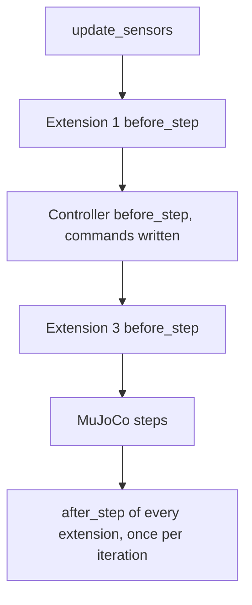

# Simulation Lifecycle

The complete lifecycle of a FARMS simulation with MuJoCo, from startup to
shutdown: which methods are called, in what order and how often.
[Trace a Simulation Step](../tutorials/simulation-workflow.md) shows the
code of each step.

## Phase 1: Startup

```text
run_sim.py                          # Adds the experiment folder to sys.path
  → farms_sim._bootstrap.main()     # Re-executes under mjpython on macOS
    → farms_sim.farmsim.profile_simulation()
      → farms_sim.farmsim.main()    # Profiled when --profile is given
        → farms_sim.simulation.setup_from_clargs()
        → ExperimentData.from_options()
        → farms_sim.simulation.run_simulation()
```

1. **Arguments and options.** `setup_from_clargs()` parses the command
   line (`sim_parse_args()`, which ignores unknown arguments) and loads
   the options with `ExperimentOptions.load()`, which reads the experiment
   file and the files it lists with the classes of `loaders:` (see
   [Options and YAML Internals](../internals/options-yaml-internals.md)).
2. **Data.** The class of `loaders.experiment_data` allocates the arrays
   (`from_options()`): `runtime.n_iterations` times, and
   `runtime.buffer_size` iterations of sensor data per animat.
3. **Run.** `run_simulation()` creates the simulation with
   `simulation_setup()` (`Simulation.from_experiment()` for MuJoCo) and
   calls `sim.run()`.

## Phase 2: Simulation setup

### 2a. MJCF construction

`setup_mjcf_xml()` builds the MuJoCo model:

1. arena SDF files: ground, water visual, and the ground height;
2. animat SDF files: bodies, joints, visual geoms (group 1) and collision
   geoms (group 2), spawned at `spawn.pose` with the `spawn.mode`
   constraints;
3. morphology options: friction of the collision geoms, joint stiffness,
   damping and spring reference, self collision pairs;
4. motors: position and velocity actuators with their gains and limits;
5. MuJoCo sensors for links, joints, actuators and contacts;
6. MuJoCo options: timestep (`physics.timestep/(cb_sub_steps*num_sub_steps)`),
   gravity, and the `mujoco` block (solver, integrator, ...).

The model is compiled into a dm_control `Physics`.

### 2b. Task and environment

`ExperimentTask` is created with the options and the data. Its
constructor creates every extension with `from_options()`
(`extract_extensions()`): the simulation extensions, then those of each
animat. The task and the physics are wrapped in a dm_control
`Environment`, with `n_sub_steps = physics.num_sub_steps`.

## Phase 3: Episode initialisation

`ExperimentTask.initialize_episode(physics)`, once at time 0:

1. builds the maps from names to MuJoCo indices (links, joints,
   actuators, sensors) and between MuJoCo and the sensor arrays;
2. collects the controllers (the extensions that are `AnimatController`
   instances) and maps their joints to the actuators;
3. resets the physics to keyframe 0 (the spawn pose);
4. calls `initialize_episode(task, physics)` on every extension (for
   example, `SwimmingExtension` builds its `SwimmingHandler`,
   `ExperimentOptionsLogger` writes the options files and `MjcfSaver` the
   MuJoCo model).

## Phase 4: Main loop

An iteration is `physics.cb_sub_steps` environment steps. For each
environment step, dm_control calls:

### before_step()

```text
ExperimentTask.before_step(action, physics)
  ├── update_sensors(physics)            (links only on the substeps)
  └── for extension in extensions:       (on the first substep of an iteration,
        extension.before_step(...)        or on every substep if substep=True)
        if the extension is a controller:
            write its positions(), velocities(), torques(), ... to MuJoCo
```

### physics step

MuJoCo advances by `physics.num_sub_steps` steps, with the actuator
controls and the external forces (`xfrc_applied`) set in `before_step()`.

### after_step()

```text
ExperimentTask.after_step(physics)
  └── at the end of an iteration:
        iteration += 1
        for extension in extensions:
            extension.after_step(task, physics)
```

## Phase 5: Shutdown

When the loop ends (all iterations done, time limit, or Q in the viewer),
`Simulation.run()` calls `end_episode(task, physics)` on every extension
(`ExperimentLogger` writes `simulation.hdf5`, `CameraRecording` finishes
the video), then closes the simulation.

!!! note "Command line post-processing"
    `--log_path`, `--prompt` and `--verify_save` are parsed but not used
    by `farms_sim.farmsim.main()`: the data is saved by the
    `ExperimentLogger` extension. See the [CLI Reference](../reference/env/cli.md).

## Viewer or headless

| `runtime.headless` | Behaviour |
|------|----------|
| `false` | MuJoCo's passive viewer (or dm_control's with `mujoco.viewer: dm_control`), real time unless `runtime.fast`, keys: Space (pause), Q (quit), + and - (speed), Right arrow (one iteration when paused) |
| `true` | A loop over the iterations, with a progress bar when `runtime.show_progress` is true |

## Extension execution order

Extensions run in the order of the files: simulation extensions first,
then the extensions of each animat, in the order of `extensions:`.


```mermaid
graph TD
    A[update_sensors] --> B[Extension 1 before_step]
    B --> C[Controller before_step, commands written]
    C --> D[Extension 3 before_step]
    D --> E[MuJoCo steps]
    E --> F[after_step of every extension, once per iteration]
```

All extensions run before the MuJoCo step, from the state at the start
of the step. The order matters only when an extension reads what another
wrote in the same step: for example, the `xfrc` sensors of a link are
written by `SwimmingExtension` in its `before_step()`, so an extension
that reads them in the same step must be listed after it.

## See also

- [System Architecture](architecture.md)
- [Extension and Controller Design](extension-design.md)
- [Data Flow and Persistence](data-flow.md)
- [ExperimentTask Internals](../internals/experiment-task-internals.md)
