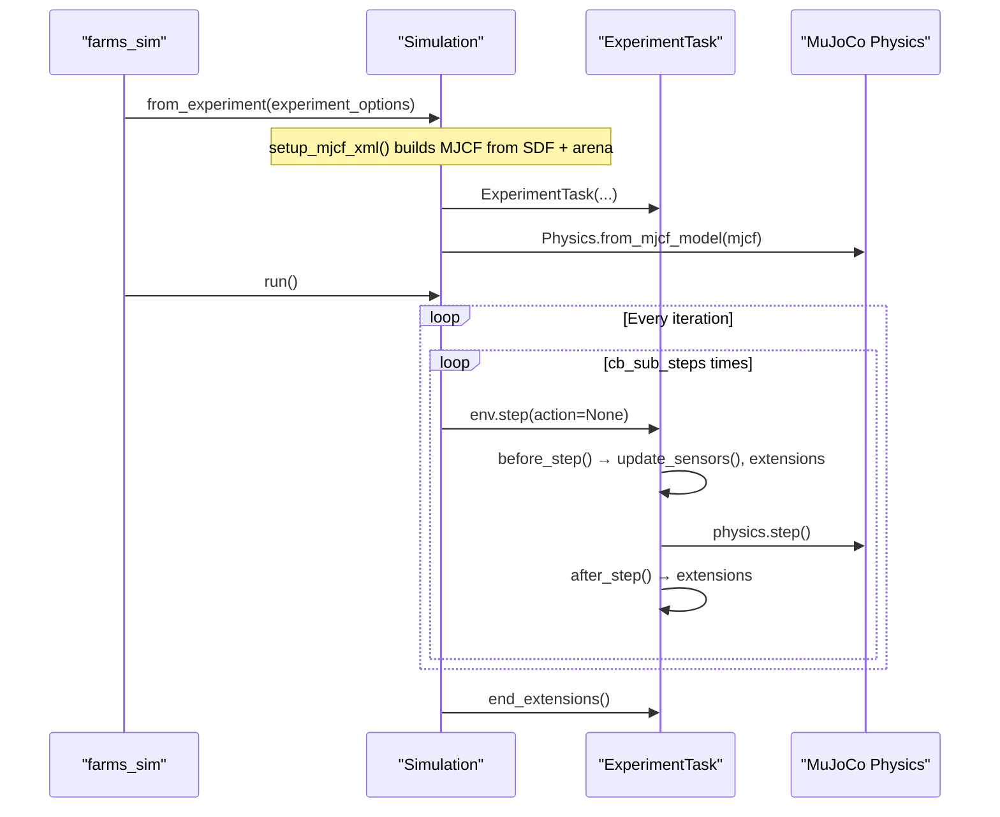

# `farms_mujoco` — MuJoCo Physics Backend

`farms_mujoco` is the MuJoCo physics backend for FARMS. It wraps MuJoCo via Google DeepMind's `dm_control` library, handles MJCF model generation from SDF, and runs the simulation loop.

**Source**: `farms_mujoco/farms_mujoco/simulation/`

---

## Overview

`farms_mujoco` translates a FARMS experiment configuration into a compiled MuJoCo model, manages the `dm_control` task lifecycle, and dispatches `TaskExtension` callbacks on every physics step. It does not define controllers or neural networks — those are injected via the extension system.

The module provides two viewer backends: the `dm_control` application viewer and the native MuJoCo passive viewer (selected via `simulation.mujoco.viewer` in YAML).

---

## MJCF Model Generation

MuJoCo does not natively understand SDF files. When `farms_mujoco` starts, `setup_mjcf_xml()` converts all SDF models to MuJoCo's XML format (MJCF) before the physics engine is initialised. This pipeline:

1. **Parses the arena SDF** — builds the ground/water plane MJCF scene.
2. **Parses each animat SDF** — reads every `<link>` (inertial, visual, collision geometry) and `<joint>` (type, axis, limits) and converts them to MJCF equivalents.
3. **Injects link/joint properties from YAML** — overrides from `animat_config.yaml` (e.g., `density`, `drag_coefficients`, `friction`) are applied on top of the SDF values.
4. **Adds a free joint** for floating-base robots (when `spawn.mode` is `free`), allowing full 6-DoF motion.
5. **Merges** the animat MJCF into the arena MJCF scene.

### Saving the Generated MJCF for Debugging

You can dump the final compiled MJCF XML to disk to inspect the model geometry, link names, and contact pairs. Enable this with the `MjcfSaver` extension:

```yaml
# simulation_config.yaml
extensions:
  - loader: farms_mujoco.simulation.extensions.MjcfSaver
    config:
      path: Output/simulation_mjcf.xml
```

Open the resulting XML file to verify that:
- All link names match exactly what you specified in `animat_config.yaml`
- Collision geometries look correct (wrong scale or wrong mesh is a common issue)
- The free-joint is present at the animat root link

!!! tip
    If the simulation crashes with a `KeyError` on a link or joint name, the MJCF is the first place to check. The name in the error message will match an MJCF attribute, not an SDF attribute.

---

## The Simulation Lifecycle



---

## Key Classes

### `Simulation`

```python
class Simulation:
    def __init__(
        self,
        mjcf_model: mjcf.element.RootElement,
        base_links: list[str],
        experiment_options: ExperimentOptions,
        legacy_step: bool = False,
        **kwargs,
    )
```

| Parameter | Type | Default | Description |
|-----------|------|---------|-------------|
| `mjcf_model` | `mjcf.RootElement` | *(required)* | Compiled dm_control MJCF model |
| `base_links` | `list[str]` | *(required)* | Names of animat root links (free joints) |
| `experiment_options` | `ExperimentOptions` | *(required)* | Full experiment configuration |
| `legacy_step` | `bool` | `False` | If `True`, uses legacy `dm_control` step; set `False` for correct contact force computation |

**Factory method**:

```python
@classmethod
def from_experiment(cls, experiment_options: ExperimentOptions, **kwargs)
```

Calls `setup_mjcf_xml(experiment_options, ...)` to generate the MJCF, then constructs `Simulation`. The preferred construction path — do not call `__init__` directly.

**Key keyword arguments for `from_experiment`**:

| Name | Type | Default | Description |

|---------|------|---------|-------------|
| `save_mjcf` | `bool` | `False` | Write generated MJCF XML to disk |
| `handle_exceptions` | `bool` | `False` | Catch `PhysicsError` without re-raising |
| `n_sub_steps` | `int` | from options | `dm_control` Environment sub-steps per control step |

**Methods**:

| Method | Description |
|--------|-------------|
| `run()` | Blocking simulation loop. Launches viewer if not headless. Calls `end_extensions()` on completion. |
| `iterator(show_progress, verbose)` | Generator alternative to `run()` — yields iteration index, allows manual stepping |
| `save_mjcf_xml(path, verbose)` | Writes MJCF XML string to file |
| `viewer_callback(keycode)` | Handles keyboard input in passive viewer mode (Space=pause, Q=quit, +/-=speed) |

!!! warning
    `Simulation.postprocess()` raises `DeprecationWarning` in current source. Use `ExperimentLogger` (registered as a `TaskExtension`) for data saving instead.

---

### `ExperimentTask` Internals

`ExperimentTask` is the bridge between `dm_control`'s task API and the FARMS extension system. Understanding its internals is essential for writing efficient extensions.

#### `update_sensors()`

At every substep, `ExperimentTask.update_sensors()` copies raw MuJoCo physics buffers into the FARMS `AnimatData.sensors` ring buffer:

| MuJoCo buffer | Copied to FARMS array |
|--------------|----------------------|
| `physics.data.qpos` | `sensors.joints.positions` |
| `physics.data.qvel` | `sensors.joints.velocities` |
| `physics.data.xpos` | `sensors.links.positions` |
| `physics.data.xmat` | `sensors.links.orientations` (as rotation matrices) |
| `physics.data.xquat` | `sensors.links.quaternions` |
| `physics.data.cfrc_ext` | `sensors.contacts.array` |
| `physics.data.xfrc_applied` | `sensors.xfrc.array` |

This copy happens **before** extensions are called in `before_step()`, so extensions always see the current-step physics state.

#### The `maps` Attribute

`task.maps` is a **list of 3 dictionaries** (one per collection pass) that maps human-readable names to integer MuJoCo body IDs:

```python
# Structure: task.maps[i] where i=0 sensors, i=1 ctrl, i=2 muscles/inertias
# Each element is a dict with keys: 'sensors', 'ctrl', 'muscles', 'inertias'
# Each key maps link_name -> data array

class MyExtension(TaskExtension):
    def initialize_episode(self, task, physics):
        # Cache body IDs once — much faster than name lookup every step
        self._head_id = physics.model.body('Head').id
        self._joint_1_id = physics.model.joint('joint_1').id

    def before_step(self, task, action, physics):
        # Use cached integer ID for direct array access — zero overhead
        head_pos = physics.data.xpos[self._head_id]
        joint_1_angle = physics.data.qpos[self._joint_1_id]
```

#### `task.iteration`

`task.iteration` is a global substep counter that increments every `before_step()` call. It is **not** the same as the outer loop iteration — it counts substeps. Use it with `% buffer_size` for ring buffer indexing.

---

## Hydrodynamics

For aquatic and amphibious robots, `farms_mujoco.swimming` implements a phenomenological drag model in Cython (`swimming/drag.pyx`). See [Hydrodynamic Swimming](api/farms_mujoco_swimming.md) for the full reference.

### Registering the Swimming Extension

Add `SwimmingExtension` to the **animat** extensions list (not the simulation-level list) in `animat_config.yaml`:

```yaml
# animat_config.yaml
extensions:
  - loader: farms_amphibious.control.amphibious.AmphibiousController
    config: {}
  - loader: farms_mujoco.swimming.extension.SwimmingExtension
    config:
      water_properties: null   # null = use arena_config.yaml water settings
```

### Drag Coefficient Sign Convention

The drag coefficients in `LinkOptions.drag_coefficients` control force magnitude and direction:

- **Negative coefficients** (e.g., `-4.0`): the force opposes the link's velocity → resistive drag.
- **Positive coefficients**: the force adds to the link's velocity → thrust (unusual; used for fin models).

The TailSegment in Zbot uses larger magnitude (`-10.0`) than body links (`-4.0`) to generate more resistance at the tail, amplifying propulsive thrust during undulation.

### Buoyancy and Density

The buoyancy force is controlled by `LinkOptions.density` relative to the water density (`WaterOptions.density`, default 1000 kg/m³):

| Density (kg/m³) | Buoyancy Effect |
|-----------------|-----------------|
| < 1000 | Link is positively buoyant — floats upward |
| = 1000 | Neutrally buoyant |
| > 1000 | Negatively buoyant — sinks |

Zbot links use `density: 950.0` — slightly less than water, so the robot is naturally buoyant and tends to float unless actively submerged.

### Coordinate Frame for Drag Forces

Drag forces are computed in the **URDF/link-local frame** (using the link's relative velocity rotated into its own coordinate system), then rotated to the **world frame** using the quaternion sandwich product before being written to `physics.data.xfrc_applied`. This is the same rotation operation documented in the [Mathematical Models](./mathematical_models.md) coordinate transforms section.

**Implemented forces** (per body link):
- Translational drag: quadratic in link velocity, anisotropic per-axis coefficients
- Rotational drag: quadratic in angular velocity
- Buoyancy: upward force proportional to submerged volume fraction

!!! warning "DISCREPANCY FLAG"
    Added mass and lift are **not implemented**. Any documentation predating 2024 that mentions these forces is outdated. Only drag and buoyancy exist in the current codebase.

---

## Viewer Configuration

Two viewer backends are available, selected by `simulation.mujoco.viewer` in YAML:

| Value | Backend | Notes |
|-------|---------|-------|
| `MuJoCo` | MuJoCo passive viewer | `mujoco.viewer.launch_passive()` with key callbacks — recommended |
| `dm_control` | `FarmsApplication` | Full dm_control viewer with GUI controls |

**Viewer keyboard shortcuts** (passive viewer):

| Key | Action |
|-----|--------|
| `Space` | Toggle pause |
| `Q` | Quit |
| `+` / `=` | Double simulation speed |
| `-` | Halve simulation speed |
| `→` (Right arrow) | Single-step while paused |

---

## Applying Custom External Forces

Any `TaskExtension` can inject forces into MuJoCo during `before_step`. The recommended pattern caches body IDs in `initialize_episode` rather than doing a name lookup on every step:

```python
from farms_core.simulation.extensions import TaskExtension
import numpy as np

class ThrusterExtension(TaskExtension):
    """Applies a configurable thrust force to a named link."""

    def __init__(self, link_name: str, force_body_local: np.ndarray):
        super().__init__(substep=True)
        self.link_name = link_name
        self.force_local = force_body_local  # Force in body-local frame
        self._body_id = None
        self._force_world = np.zeros(6)     # Pre-allocate to avoid GC pressure

    def initialize_episode(self, task, physics):
        # Cache the integer body ID once — avoids repeated name lookup per step
        self._body_id = physics.model.body(self.link_name).id

    def before_step(self, task, action, physics):
        # Rotate body-local force to world frame using the body's rotation matrix
        # physics.data.xmat[body_id] is a 9-element row-major rotation matrix
        R = physics.data.xmat[self._body_id].reshape(3, 3)
        force_world = R @ self.force_local[:3]

        # Write [Fx, Fy, Fz, Tx, Ty, Tz] in world frame (N, N·m)
        self._force_world[:3] = force_world
        # IMPORTANT: Use += to accumulate with other active extensions
        physics.data.xfrc_applied[self._body_id] += self._force_world
```

!!! note "Force Coordinate Frame"
    `xfrc_applied` is in the **world/global coordinate frame**. Forces computed in a body-local frame must be rotated first using the body's rotation matrix `physics.data.xmat[body_id].reshape(3, 3)`.

!!! warning "Always Use `+=`"
    Never assign `physics.data.xfrc_applied[i] = ...`. Always accumulate with `+=`. Overwriting with `=` will erase forces applied by other extensions such as `SwimmingExtension`.

---

## Common Pitfalls

!!! warning "`legacy_step=True` Disables Contact Forces"
    Setting `legacy_step=True` in `Simulation.__init__` (or via the `from_experiment` keyword) disables correct contact force computation in `dm_control`. Always keep it at the default `False`. It exists only for backward compatibility with very old experiments.

!!! warning "Viewer Requires a Display"
    The MuJoCo viewer window requires a running X11 or Wayland display server. On SSH connections or cluster nodes without a display, the simulation will hang or crash when the viewer tries to open. Always set `headless: true` in `simulation_config.yaml` for remote or batch runs.

!!! warning "Name Mismatch Causes Silent Failures"
    If a link or joint name in `animat_config.yaml` does not exactly match the corresponding name in the SDF file (including case), FARMS may silently skip applying that property, or crash with a `KeyError` deep in the MJCF builder. Save and inspect the generated MJCF XML (using `MjcfSaver`) to verify all names resolved correctly.

---

## See Also

- [ExperimentTask & visual extensions](api/farms_mujoco_simulation.md)
- [Hydrodynamic swimming model](api/farms_mujoco_swimming.md)
- [TaskExtension base class](api/farms_core_control.md)
- [System architecture & execution loop](./architecture.md)
- [Mathematical Models — Coordinate Transforms](./mathematical_models.md)

## Source Code

`farms_mujoco/farms_mujoco/simulation/simulation.py`
