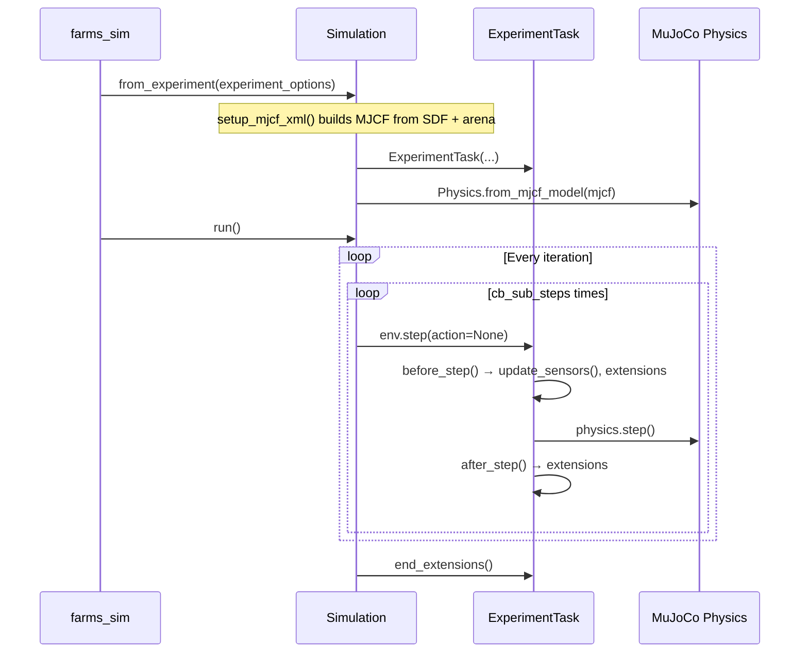

# `farms_mujoco` — MuJoCo Physics Backend

`farms_mujoco` is the MuJoCo physics backend for FARMS. It wraps MuJoCo via Google DeepMind's `dm_control` library, handles MJCF model generation from SDF, and runs the simulation loop.

**Source**: `farms_mujoco/farms_mujoco/simulation/`

---

## Overview

`farms_mujoco` translates a FARMS experiment configuration into a compiled MuJoCo model, manages the `dm_control` task lifecycle, and dispatches `TaskExtension` callbacks on every physics step. It does not define controllers or neural networks — those are injected via the extension system.

The module provides two viewer backends: the `dm_control` application viewer and the native MuJoCo passive viewer (selected via `simulation.mujoco.viewer` in YAML).

---

## The Simulation Lifecycle



---

## Key Classes

### `Simulation`

```python
class Simulation:
    def __init__(
        self,
        mjcf_model: mjcf.element.RootElement,
        base_links: list[str],
        experiment_options: ExperimentOptions,
        legacy_step: bool = False,
        **kwargs,
    )
```

| Parameter | Type | Default | Description |
|-----------|------|---------|-------------|
| `mjcf_model` | `mjcf.RootElement` | *(required)* | Compiled dm_control MJCF model |
| `base_links` | `list[str]` | *(required)* | Names of animat root links (free joints) |
| `experiment_options` | `ExperimentOptions` | *(required)* | Full experiment configuration |
| `legacy_step` | `bool` | `False` | If `True`, uses legacy `dm_control` step; set `False` for correct contact force computation |

**Factory method**:

```python
@classmethod
def from_experiment(cls, experiment_options: ExperimentOptions, **kwargs)
```

Calls `setup_mjcf_xml(experiment_options, ...)` to generate the MJCF, then constructs `Simulation`. The preferred construction path — do not call `__init__` directly.

**Key keyword arguments for `from_experiment`**:

| Keyword | Type | Default | Description |
|---------|------|---------|-------------|
| `save_mjcf` | `bool` | `False` | Write generated MJCF XML to disk |
| `handle_exceptions` | `bool` | `False` | Catch `PhysicsError` without re-raising |
| `n_sub_steps` | `int` | from options | `dm_control` Environment sub-steps per control step |

**Methods**:

| Method | Description |
|--------|-------------|
| `run()` | Blocking simulation loop. Launches viewer if not headless. Calls `end_extensions()` on completion. |
| `iterator(show_progress, verbose)` | Generator alternative to `run()` — yields iteration index, allows manual stepping |
| `save_mjcf_xml(path, verbose)` | Writes MJCF XML string to file |
| `viewer_callback(keycode)` | Handles keyboard input in passive viewer mode (Space=pause, Q=quit, +/-=speed) |

**Warning**: `Simulation.postprocess()` raises `DeprecationWarning` in current source. Use `ExperimentLogger` (registered as a `TaskExtension`) for data saving instead.

---

### `ExperimentTask` Internals

`ExperimentTask` is the bridge between `dm_control`'s task API and the FARMS extension system. Understanding its internals is essential for writing efficient extensions.

#### `update_sensors()`

At every substep, `ExperimentTask.update_sensors()` copies raw MuJoCo physics buffers into the FARMS `AnimatData.sensors` ring buffer:

| MuJoCo buffer | Copied to FARMS array |
|--------------|----------------------|
| `physics.data.qpos` | `sensors.joints.positions` |
| `physics.data.qvel` | `sensors.joints.velocities` |
| `physics.data.xpos` | `sensors.links.positions` |
| `physics.data.xmat` | `sensors.links.orientations` (as rotation matrices) |
| `physics.data.xquat` | `sensors.links.quaternions` |
| `physics.data.cfrc_ext` | `sensors.contacts.array` |
| `physics.data.xfrc_applied` | `sensors.xfrc.array` |

This copy happens **before** extensions are called in `before_step()`, so extensions always see the current-step physics state.

#### The `maps` Attribute

`task.maps` is a nested dictionary that maps human-readable names to integer MuJoCo body IDs:

```python
# Structure: task.maps.links[animat_name][link_name] -> int body_id
# Structure: task.maps.joints[animat_name][joint_name] -> int joint_id

class MyExtension(TaskExtension):
    def initialize_episode(self, task, physics):
        # Cache body IDs once — much faster than name lookup every step
        self._head_id = task.maps.links['zbot']['Head']
        self._joint_1_id = task.maps.joints['zbot']['joint_1']

    def before_step(self, task, action, physics):
        # Use cached integer ID for direct array access — zero overhead
        head_pos = physics.data.xpos[self._head_id]
        joint_1_angle = physics.data.qpos[self._joint_1_id]
```

#### `task.iteration`

Core bridge between `dm_control`'s task API and the FARMS extension system. See [farms_mujoco_simulation.md](api/farms_mujoco_simulation.md) for the full class reference.

---

## Hydrodynamics

For aquatic and amphibious robots, `farms_mujoco.swimming` implements a phenomenological drag model in Cython (`swimming/drag.pyx`). See [Hydrodynamic Swimming](api/farms_mujoco_swimming.md) for the full reference.

**Implemented forces** (per body link):
- Translational drag: quadratic in link velocity, anisotropic per-axis coefficients
- Rotational drag: quadratic in angular velocity
- Buoyancy: upward force proportional to submerged volume

**Warning**: Added mass and lift are **not implemented**. Any documentation predating 2024 that mentions these forces is outdated.

---

## Viewer Configuration

Two viewer backends are available, selected by `simulation.mujoco.viewer` in YAML:

| Value | Backend | Notes |
|-------|---------|-------|
| `dm_control` | `FarmsApplication` | Full dm_control viewer with GUI controls |
| *(any other)* | MuJoCo passive viewer | `mujoco.viewer.launch_passive()` with key callbacks |

**Viewer keyboard shortcuts** (passive viewer):

| Key | Action |
|-----|--------|
| `Space` | Toggle pause |
| `Q` | Quit |
| `+` / `=` | Double simulation speed |
| `-` | Halve simulation speed |
| `→` (Right arrow) | Single-step while paused |

---

## Applying Custom External Forces

Any `TaskExtension` can inject forces into MuJoCo during `before_step`:

```python
from farms_core.simulation.extensions import TaskExtension
import numpy as np

class ThrusterExtension(TaskExtension):
    """Applies a configurable thrust force to a named link."""

    def __init__(self, link_name: str, force_body_local: np.ndarray):
        super().__init__(substep=True)
        self.link_name = link_name
        self.force_local = force_body_local  # Force in body-local frame
        self._body_id = None
        self._force_world = np.zeros(6)     # Pre-allocate to avoid GC pressure

    def initialize_episode(self, task, physics):
        # Cache the integer body ID once — avoids repeated name lookup per step
        self._body_id = task.maps.links['my_robot'][self.link_name]

class CustomForceExtension(TaskExtension):
    def before_step(self, task, action, physics):
        body_id = task.maps.links["my_robot"]["tail_link"]
        # Force vector [Fx, Fy, Fz, Tx, Ty, Tz] in world frame (N, N·m)
        physics.data.xfrc_applied[body_id] += [0.0, 0.0, 5.0, 0.0, 0.0, 0.0]
```

**Note**: `xfrc_applied` is in the **world/global coordinate frame**. If your force is computed in a body-local frame, rotate it using `physics.data.xmat[body_id].reshape(3, 3)` before applying.

---

## See Also

- [ExperimentTask & visual extensions](api/farms_mujoco_simulation.md)
- [Hydrodynamic swimming model](api/farms_mujoco_swimming.md)
- [TaskExtension base class](api/farms_core_control.md)
- [System architecture & execution loop](./architecture.md)
- **Source**: `farms_mujoco/farms_mujoco/simulation/simulation.py`
