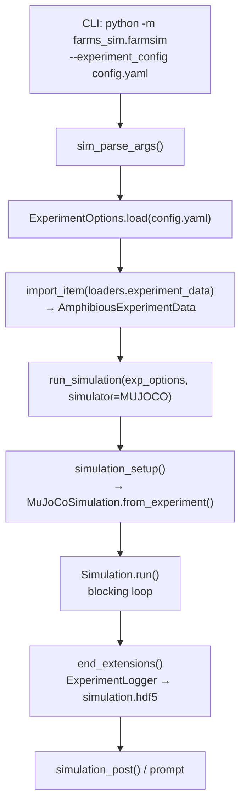

# `farms_sim` — Simulation Orchestrator

`farms_sim` is the top-level entry point for the FARMS framework. It parses CLI arguments, loads experiment configuration, dynamically resolves the physics backend, and drives the simulation loop. It defines no domain-specific controllers or physics models — those live in `farms_mujoco` and `farms_amphibious`.

**Source**: `farms_sim/farms_sim/simulation.py`, `farms_sim/farms_sim/farmsim.py`

---

## Overview

`farms_sim` operates in a purely functional style — it has no class hierarchy of its own. The module provides five public functions covering the full simulation lifecycle: argument parsing, backend setup, execution, post-processing, and interactive prompts.

Backend selection is determined at import time: `farms_sim` attempts to import `farms_mujoco` and `farms_bullet`, flags each as available, and raises a `ModuleNotFoundError` at startup if **neither** backend is installed.

```python
# farms_sim/simulation.py — backend detection at import time
ENGINE_MUJOCO = False
try:
    from farms_mujoco.simulation.simulation import Simulation as MuJoCoSimulation
    ENGINE_MUJOCO = True
except ModuleNotFoundError:
    MuJoCoSimulation = None
except ImportError as e:
    raise ImportError(f"farms_mujoco is installed but failed to import: {e}") from e

if not ENGINE_MUJOCO and not ENGINE_BULLET:
    raise ModuleNotFoundError('Neither MuJoCo nor Bullet packages are installed')
```

The two available backends:

| Backend | Module | `Simulator` enum |
|---------|--------|-----------------|
| MuJoCo (via `dm_control`) | `farms_mujoco` | `Simulator.MUJOCO` |
| Bullet (PyBullet) | `farms_bullet` (optional) | `Simulator.PYBULLET` |

---

## Simulation Lifecycle

The following diagram shows the complete flow from CLI invocation to data output:



### The `loaders` Mechanism

`farmsim.py` uses `import_item()` to dynamically load the `ExperimentData` subclass specified in the experiment config's `loaders` section. This is what allows `farms_sim` to be used with any domain-specific data class (e.g., `AmphibiousExperimentData`) without compile-time knowledge of it:

```python
# farmsim.py
experiment_data_loader = import_item(exp_options.loaders.experiment_data)
experiment_data = experiment_data_loader.from_options(exp_options)
```

The corresponding YAML section in `experiment_config.yaml`:

```yaml
loaders:
  simulation_options: farms_core.simulation.options.SimulationOptions
  animats_options:
    - farms_amphibious.model.options.AmphibiousOptions
  arenas_options:
    - farms_amphibious.model.options.AmphibiousArenaOptions
  experiment_data: farms_amphibious.data.data.AmphibiousExperimentData
  animats_data:
    - farms_amphibious.data.data.AmphibiousData
```

!!! important
    The class path under `experiment_data` must be importable in the active Python environment. If the package is not installed, `import_item()` will raise an `ImportError` at startup — before any physics is initialised.

---

## Entry Point

### Command-Line

```bash
python -m farms_sim.farmsim \
    --experiment_config <path/to/experiment_config.yaml> \
    [--simulator MUJOCO|PYBULLET] \
    [--log_path <output_dir>] \
    [--profile <filename>] \
    [--prompt] \
    [--verify_save] \
    [--test_configs]
```

| Flag | Type | Default | Description |
|------|------|---------|-------------|
| `--experiment_config` | `str` | `None` *(required)* | Path to the experiment YAML manifest |
| `--simulator` | `str` | `MUJOCO` | Backend: `MUJOCO` or `PYBULLET` |
| `--log_path` | `str` | `''` | Output directory for HDF5 data and YAML configs |
| `--profile` | `str` | `''` | Save cProfile output to this filename (empty = disabled) |
| `--prompt` | flag | off | Interactive post-processing prompt after run |
| `--verify_save` | flag | off | Prompt to confirm before overwriting saved data |
| `--test_configs` | flag | off | Save and reload options files as a config round-trip test |

!!! tip
    For batch/cluster jobs, set `headless: true` in `simulation_config.yaml`. For interactive use with the MuJoCo viewer, omit `headless` (defaults to `false`) and set `play: true`.

---

## Function Reference

### `setup_from_clargs`

```python
def setup_from_clargs(clargs=None, **kwargs) -> tuple[Namespace, ExperimentOptions, Simulator]
```

Parses CLI arguments and loads the experiment configuration from YAML.

**Parameters**:

| Name | Type | Default | Description |

|-----------|------|---------|-------------|
| `clargs` | `Namespace \| None` | `None` | Pre-parsed argument namespace; if `None`, calls `sim_parse_args()` internally |
| `experiment_options_loader` | `type` | `ExperimentOptions` | Class used to deserialise the YAML (override for custom options subclasses) |

**Returns**: `(clargs, experiment_options, simulator)` — the parsed args namespace, the fully-loaded options object, and the `Simulator` enum value.

**Error behaviour**: If `clargs.experiment_config` is `None` or the file does not exist, raises `AssertionError`. If a required YAML field is missing or the wrong type, `ExperimentOptions.load()` raises `KeyError` or `TypeError` before any physics engine is touched.

**Example**:

```python
from farms_sim.simulation import setup_from_clargs

# Parse sys.argv
clargs, exp_options, simulator = setup_from_clargs()

# Or pass pre-constructed args (useful in scripts)
from argparse import Namespace
clargs = Namespace(
    experiment_config='configs/zbot.yaml',
    simulator='MUJOCO',
    log_path='Output',
    prompt=False,
    verify_save=False,
    test_configs=False,
    profile='',
)
clargs, exp_options, simulator = setup_from_clargs(clargs=clargs)
```

---

### `simulation_setup`

```python
def simulation_setup(
    experiment_options: ExperimentOptions,
    **kwargs,
) -> MuJoCoSimulation | PybulletSimulation
```

Instantiates the physics backend **without running** it. Use this when you need programmatic access to the simulation object (e.g., RL integration).

**Keyword arguments**:

| Name | Type | Default | Description |

|---------|------|---------|-------------|
| `simulator` | `Simulator` | `Simulator.MUJOCO` | Backend selection |
| `experiment_data` | `ExperimentData \| None` | auto-constructed | Pre-built data container; if not provided, constructed via `experiment_data_class.from_options(experiment_options)` |
| `experiment_data_class` | `type` | `ExperimentData` | Class for data construction when `experiment_data` is not supplied |
| `extensions` | `list[TaskExtension]` | `[]` | Additional `TaskExtension` instances to inject programmatically (MuJoCo only) |
| `save_mjcf` | `bool` | `False` | Write generated MJCF XML to disk before simulation starts |
| `handle_exceptions` | `bool` | `False` | Catch `PhysicsError` inside the task loop without re-raising |

For MuJoCo, internally calls `MuJoCoSimulation.from_experiment(...)`. For PyBullet, calls the legacy `sim_loader(...)` interface.

!!! warning "Unknown kwargs raise AssertionError"
    `simulation_setup` calls `assert not kwargs` after consuming all known keywords. Passing an unrecognised keyword argument will raise `AssertionError`. Check the keyword list above carefully.

---

### `run_simulation`

```python
def run_simulation(
    experiment_options: ExperimentOptions,
    **kwargs,
) -> MuJoCoSimulation | PybulletSimulation
```

Convenience wrapper that calls `simulation_setup` then runs the blocking simulation loop to completion.

- **MuJoCo**: calls `sim.run()` — blocks until `n_iterations` is reached or the viewer is closed.
- **PyBullet**: iterates `sim.iterator(show_progress=...)` manually.

Accepts **all** `simulation_setup` keyword arguments. Returns the completed simulation object (sensor data available via `sim.task.data` or through the registered `ExperimentLogger`).

---

### `simulation_post`

```python
def simulation_post(sim, log_path='', plot=False, video='')
```

Invokes post-processing on a completed simulation object by calling `sim.postprocess(...)`.

| Name | Type | Default | Description |

|-----------|------|---------|-------------|
| `sim` | `MuJoCoSimulation` | *(required)* | Completed simulation object |
| `log_path` | `str` | `''` | Directory to write HDF5 data and YAML configs |
| `plot` | `bool` | `False` | Generate and display analysis plots |
| `video` | `str` | `''` | Output video path; ignored if `sim.options.headless` is `True` |

!!! warning "Deprecation"
    `Simulation.postprocess()` is deprecated in current source. Prefer using the `ExperimentLogger` `TaskExtension` registered in YAML for data saving. `simulation_post` is kept for backward compatibility.

---

### `postprocessing_from_clargs`

```python
def postprocessing_from_clargs(sim, clargs=None, **kwargs)
```

Interactive post-processing driven by CLI arguments. Calls `prompt_postprocessing` which presents a user prompt to save, plot, or replay data. Activated by the `--prompt` flag at the CLI.

---

## Usage Patterns

### Standard Single-Run

The most common pattern — run a full simulation from a config file and save data:

```python
from farms_sim.simulation import setup_from_clargs, run_simulation, simulation_post

clargs, exp_options, simulator = setup_from_clargs()
sim = run_simulation(exp_options, simulator=simulator)
simulation_post(sim, log_path=clargs.log_path, plot=False)
```

### Scripted Run (No CLI Parsing)

For use in experiment automation or unit tests where you want to bypass `sys.argv`:

```python
from argparse import Namespace
from farms_sim.simulation import setup_from_clargs, run_simulation

clargs = Namespace(
    experiment_config='configs/experiment.yaml',
    simulator='MUJOCO',
    log_path='Output',
    prompt=False,
    verify_save=False,
    test_configs=False,
    profile='',
)
clargs, exp_options, simulator = setup_from_clargs(clargs=clargs)
sim = run_simulation(exp_options, simulator=simulator)
```

### Reinforcement Learning Integration

Bypass the blocking `sim.run()` loop and step the environment manually. `simulation_setup` returns the simulation object without running it, and `sim.env` is a standard `dm_control.rl.control.Environment`:

```python
from farms_sim.simulation import setup_from_clargs, simulation_setup

clargs, exp_options, simulator = setup_from_clargs()
sim = simulation_setup(exp_options, simulator=simulator)

# sim.env is a dm_control Environment — compatible with standard RL loops
timestep = sim.env.reset()
while not timestep.last():
    # observation is a dict of sensor arrays
    action = my_policy(timestep.observation)
    timestep = sim.env.step(action)

# Access raw sensor data after the loop
sensor_data = sim.task.data
```

!!! note
    In FARMS, `action` is typically `None` — control is handled by registered `TaskExtension` / `AnimatController` instances rather than the `dm_control` action spec. Only pass a non-`None` action if you have overridden `ExperimentTask.action_spec`.

### Programmatic Extension Injection

Inject additional `TaskExtension` instances at runtime without modifying YAML:

```python
from farms_sim.simulation import setup_from_clargs, simulation_setup, run_simulation
from my_package.extensions import CustomLogger

clargs, exp_options, simulator = setup_from_clargs()

custom_logger = CustomLogger(log_path='Output/custom')
sim = run_simulation(
    exp_options,
    simulator=simulator,
    extensions=[custom_logger],
)
```

---

## Configuration Reference

`farms_sim` does not own its own YAML schema — it reads whichever class is specified in the `loaders` section. The relevant runtime options are in `SimulationOptions`:

```yaml
# simulation_config.yaml
runtime:
  n_iterations: 5000      # Total simulation steps
  buffer_size: 0          # Ring-buffer size; 0 = same as n_iterations (full log)
  play: true              # Start unpaused (interactive viewer)
  headless: false         # No viewer window
  fast: false             # Run as fast as possible (ignores rtl)
  rtl: 1.0                # Real-time limiter (1.0 = real-time, 2.0 = 2× speed)
  show_progress: true     # tqdm progress bar in headless mode

physics:
  timestep: 0.002         # Physics integration step [s]
  gravity: [0, 0, -9.81]  # Gravity vector [m/s²]
  num_sub_steps: 1        # MuJoCo internal sub-steps per control step
  cb_sub_steps: 2         # FARMS callback sub-steps (controls extension call rate)
```

See [Configuration Reference](./configuration.md) for the full parameter table.

---

## Common Pitfalls

!!! warning "Missing `experiment_config` Argument"
    `setup_from_clargs()` asserts `clargs.experiment_config` is truthy. Running `python -m farms_sim.farmsim` without `--experiment_config` raises `AssertionError: No experiment config provided`. Always supply the flag or pre-build the `Namespace`.

!!! warning "Backend Import Errors at Module Load"
    If `farms_mujoco` is installed but has a broken internal import (e.g., missing compiled Cython extension after a `git pull`), `farms_sim` re-raises the error as `ImportError: farms_mujoco is installed but failed to import: ...`. This is distinct from a clean `ModuleNotFoundError` (package not installed). Fix: rebuild the Cython extensions with `pip install -e ./farms/farms_mujoco --no-build-isolation`.

!!! warning "`simulation_setup` Consumes All `kwargs`"
    The function ends with `assert not kwargs`. Any unrecognised keyword silently passes until that final check, then crashes. If you see `AssertionError: {'my_kwarg': ...}`, you passed an unknown keyword.

!!! warning "`simulation_post` Is Deprecated"
    `sim.postprocess()` is deprecated in current source. Use `ExperimentLogger` in YAML for data persistence. `simulation_post` is only kept for scripts that predate the extension-based logging pattern.

---

## See Also

- [farms_core — Framework Foundation](./farms_core.md) — Options, data structures, `TaskExtension` base class
- [farms_mujoco — MuJoCo Physics Backend](./farms_mujoco.md) — Simulation lifecycle, MJCF generation
- [farms_amphibious — Amphibious Animat Control](./farms_amphibious.md) — CPG controller, muscle models
- [System Architecture](./architecture.md) — End-to-end module interaction diagram
- [Configuration Reference](./configuration.md) — Full YAML parameter tables
- [Zbot tutorial](./zbot/index.md) — Step-by-step walkthrough using `farms_sim`

## Source Code

`farms_sim/farms_sim/simulation.py`, `farms_sim/farms_sim/farmsim.py`, `farms_sim/farms_sim/utils/parse_args.py`
