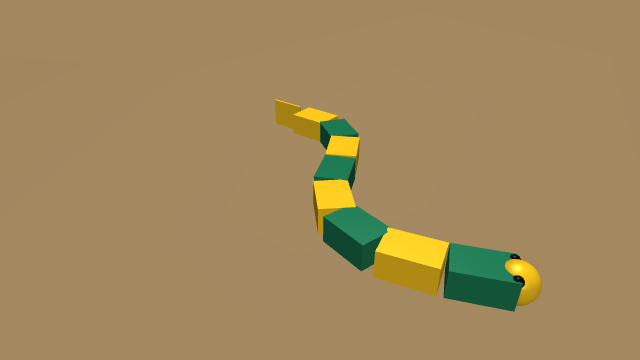
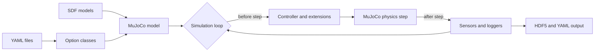

# Overview

FarmSim simulates animals and bio-inspired robots, with a focus on
locomotion: crawling, walking and swimming, driven by neural controllers
such as central pattern generators (CPGs). It is the simulation part of
FARMS (Framework for Animal and Robot Modeling and Simulation), built on
the [MuJoCo](https://mujoco.org/) physics engine.



## How a simulation is put together

An experiment is a folder of YAML files and a small run script:

```text
my_experiment/
├── experiment_config.yaml   # Lists the files below and the option classes
├── simulation_config.yaml   # Timestep, duration, viewer, loggers
├── animat_config.yaml       # The robot: SDF model, sensors, motors, controller
├── arena_config.yaml        # The world: ground, water
└── run_sim.py               # python run_sim.py --experiment_config experiment_config.yaml
```

FarmSim reads the YAML files into option classes, builds a MuJoCo model
from the SDF files, and steps the physics. At every step, the
**extensions** listed in the configuration run: the controller computes the
joint commands, the swimming extension applies the water forces, and the
loggers record the sensors. At the end, the data is saved to HDF5.



The [simulation lifecycle](../explanation/simulation-lifecycle.md) and
[architecture](../explanation/architecture.md) pages explain this in
detail.

## The four packages

| Package | Role | Main entry points |
|---|---|---|
| `farms_core` | Shared abstractions: options, data arrays, sensors, I/O, extension and controller base classes | `farms_core.model.control.AnimatController`, `farms_core.io.sdf.ModelSDF` |
| `farms_mujoco` | MuJoCo backend: MJCF builder, `ExperimentTask`, viewer, swimming and buoyancy | `farms_mujoco.simulation.task.ExperimentTask`, `farms_mujoco.swimming.extension.SwimmingExtension` |
| `farms_amphibious` | CPG network, muscle models, descending drives, amphibious options | `farms_amphibious.control.amphibious.AmphibiousController`, `farms_amphibious.model.options.AmphibiousOptions` |
| `farms_sim` | Command line that loads an experiment and runs it | `farms_sim.farmsim` |

They install in that order, because the Cython modules of each package use
the ones installed before it.

## The example robot

These docs use **AmphiBot**, an amphibious snake robot shipped in
[`examples/amphibot`](https://github.com/podalanga/farmsim_docs/tree/main/examples/amphibot):
a head and seven segments joined by yaw joints, with a free-rolling wheel
under each segment. It is inspired by AmphiBot I (Crespi, Badertscher,
Guignard and Ijspeert, EPFL BioRob, 2005) and built from primitive shapes
only. It crawls on land, goes down a ramp and swims, which exercises most
of FarmSim: contacts, CPG control, buoyancy and drag.

## Next steps

1. [Install FarmSim](installation.md).
2. Run [your first simulation](../tutorials/first-simulation.md).
3. Follow the other [tutorials](../tutorials/index.md) in order.
