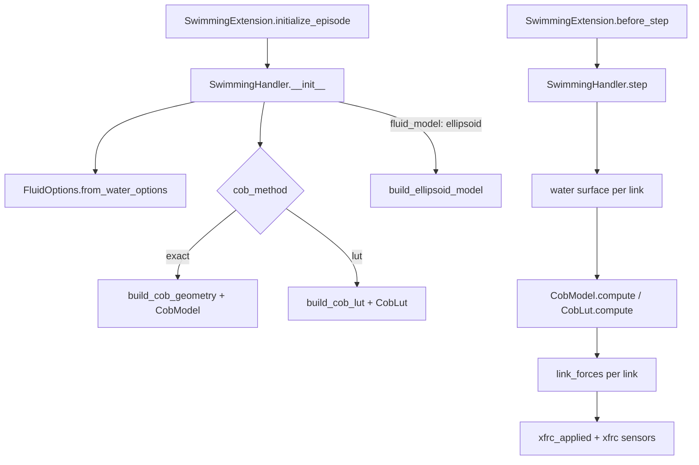

# Hydrodynamics Internals

How `farms_mujoco.swimming` computes the fluid forces, for contributors
who need to change or extend it. The user-facing options are in
[farms_mujoco.swimming](../reference/mujoco/mujoco-swimming.md) and the
equations in [Mathematical Models](../explanation/mathematical-models.md#2-hydrodynamics).

## Source files

| File | Content |
|---|---|
| `farms_mujoco/swimming/extension.py` | `SwimmingExtension` (task extension) and `load_water_maps()` |
| `farms_mujoco/swimming/hydrodynamics.pyx` | `SwimmingHandler` (the per-step C loop) and the `WaterProperties` classes |
| `farms_mujoco/swimming/fluid_options.py` | `FluidOptions`: parsing and validation of the fluid options |
| `farms_mujoco/swimming/cob.pyx` | Exact submerged volume and centroid kernels, `CobModel` |
| `farms_mujoco/swimming/cob_build.py` | Load-time geometry for `CobModel`: geoms, mesh BVHs, overlap estimate |
| `farms_mujoco/swimming/cob_lut.pyx` | Runtime lookup tables, `CobLut` |
| `farms_mujoco/swimming/cob_lut_build.py` | Construction and disk cache of the lookup tables |
| `farms_mujoco/swimming/drag.pyx` | Legacy per-axis quadratic drag (explicit and semi-implicit) |
| `farms_mujoco/swimming/ellipsoid_fit.py` | Ellipsoid fit (MVEE or inertia) and Lamb added mass coefficients |
| `farms_mujoco/swimming/ellipsoid_model.pyx` | `EllipsoidModel`: ellipsoid drag and added mass wrench |

Tests are in `farms_mujoco/tests/` (`test_cob.py`, `test_cob_lut.py`,
`test_ellipsoid.py`), benchmarks in `farms_mujoco/benchmarks/`.

## Architecture

Everything that depends on the geometry is computed once, when the handler
is created (at every episode start). The step reads the MuJoCo arrays
through typed memoryviews and makes no Python call or allocation, except
with `WaterPropertiesExtension`, whose callables are Python functions.

## SwimmingExtension

`SwimmingExtension.from_options()` ignores its `config` and uses the
water options of the first arena (`experiment_options.arenas[0]`). When
`water.velocity` is not a 3-vector, `__init__` loads the velocity maps
(`load_water_maps()`) and creates a `WaterPropertiesMaps`.

`before_step()` calls
`handler.step(time, task.iteration % task.buffer_size, task.physics_timestep)`
at every environment step (the extension is created with `substep=True`).
The link states it reads are those updated by `ExperimentTask.before_step()`
just before (`update_sensors`, links only on the substeps).

## SwimmingHandler

### Construction

`SwimmingHandler.__init__(data, animat_options, arena_options, units, physics, water=None, prefix='')`:

1. Parses the options with `FluidOptions.from_water_options()`, which
   resolves the aliases (`analytical` to `exact`, ...) and the nested
   `cob` block.
2. Reads gravity from `physics.model.opt.gravity` (not hardcoded).
3. Creates a `WaterPropertiesConstant` from the water options, unless a
   `water` object is given.
4. Keeps the links with `fluid_interaction: true`, and their MuJoCo body
   ids, sensor indices, masses, densities, drag coefficients and bounding
   radii (from the geoms of `cob_geom_group`).
5. Saves the original body masses and inertias on the physics object
   (`physics._farms_body_mass0`, `physics._farms_body_inertia0`) the
   first time, and restores them. The implicit added mass modifies them,
   and a new handler is created at every episode.
6. Builds the centre of buoyancy model: `build_cob_geometry()` and
   `CobModel` for `exact` (also for `ramp` with the ellipsoid model, which
   needs the submerged fraction), or `build_cob_lut()` for `lut`.
7. With `fluid_model: ellipsoid`, fits the ellipsoids and computes their
   added mass (`build_ellipsoid_model()`).
8. Keeps views on the MuJoCo arrays `geom_xpos`, `geom_xmat`, `xpos`,
   `xmat` and `xfrc_applied`.

### Step

`SwimmingHandler.step(time, iteration, timestep)`:

1. Evaluates the water surface height at the position of every link.
2. Computes the submerged volume $V$ and first moment $V c$ of every link
   (`CobModel.compute()` from the geom poses, or `CobLut.compute()` from
   the body poses), stored in `submerged` (`[V, Vcx, Vcy, Vcz]` per link,
   SI units).
3. Calls `link_forces()` for every link:
    - A link without submerged volume (or, with `ramp`, whose bounding
      sphere is above the surface) gets a zero wrench, and its added mass
      is removed.
    - Buoyancy $-\rho V g$, with the torque $(c_b - c_m) \times F$ about
      the link CoM. With `ramp`, $V = \frac{m}{\rho_{\text{link}}}$ times
      a linear ramp of the bounding sphere depth, without torque.
    - Drag, from the velocity of the link CoM relative to the water:
      either the legacy per-axis drag in the link frame (`drag.pyx`), or
      the ellipsoid wrench (`EllipsoidModel.wrench()`), scaled by the
      submerged fraction $V / V_{\text{full}}$.
    - With implicit added mass, `set_added_mass()` sets the body mass and
      inertia, and the weight of the added mass is cancelled by an
      opposite force.
4. Writes the wrench (world frame, at the link CoM) to the `xfrc` sensor
   array (SI units) and to `xfrc_applied` (simulation units).

Forces are computed in the world frame, rotated once where needed (link
frame for the legacy drag, ellipsoid frame for the ellipsoid model), and
never rotated again by the extension.

## Centre of buoyancy

### Exact kernels (`cob.pyx`)

Each kernel returns the volume and the first moment of the part of a solid
below the plane $z \le h$, in the world frame. The contributions of the
geoms of a link are summed.

| Geom | Method |
|---|---|
| Sphere | Closed-form spherical cap |
| Ellipsoid | The affine map $x = c + R\,\mathrm{diag}(a)\,u$ sends the unit ball to the ellipsoid and planes to planes: the submerged part is the image of a unit sphere cap, whose volume scales by $abc$ |
| Cylinder | Integral of circular segment areas along the axis. The waterline distance in each disk is linear along the axis, so the volume and moments have closed-form antiderivatives. Near-horizontal waterlines use a Taylor expansion to avoid cancellation |
| Capsule | Exact cylinder plus two hemispheres, integrated slice by slice with 12-point Gauss-Legendre quadrature on intervals split where slices become fully wet or dry (relative error about 1e-10) |
| Box, mesh | Divergence theorem over the triangles, with a BVH |

For polyhedra, the tetrahedra have their apex $p$ on the water plane, so
the waterline cap contributes nothing and only the wet part of the
surface is needed. Each BVH node stores the moments of its triangles
$(a, b, c)$:

$$
S_0 = \sum \det(a, b, c), \quad
S_1 = \sum N, \quad
m = \sum \det(a, b, c)\, s, \quad
M = \sum s N^T
$$

with $N = a \times b + b \times c + c \times a$ and $s = a + b + c$. A
fully wet node then contributes in O(1):

$$
6V = S_0 - S_1 \cdot p, \qquad
24\,V c = m - M p + p\,(S_0 - S_1 \cdot p)
$$

Fully dry nodes are skipped, and only the triangles of leaves crossing the
waterline are clipped: the cost is $O(k + \log n)$ for $k$ triangles near
the waterline. Any closed mesh, convex or not, is exact. Meshes that are
not watertight are replaced by their convex hull by `cob_build.py`.

`build_cob_geometry()` caches the geometry per model and reports the
overlap of the geoms of each link (estimated by sampling). With
`cob_overlap: scale`, the contributions are scaled by the union fraction.

### Lookup tables (`cob_lut.pyx`)

For each link, a table holds $V$, $M \cdot n$ and the component of the
first moment $M$ orthogonal to $n$ of the region $\{x : n \cdot x \le t\}$
(link frame), for the directions $n$ of an octahedral grid and depths $t$
(`cob_lut_resolution`). At runtime, the water half-space in the link frame
is $n = R^T e_z$, $t = h - p_z$, and the values are interpolated
bilinearly over the directions and linearly over the depth: O(1) per
link.

`build_cob_lut()` samples the tables with the exact kernels when the
geoms do not overlap, and from a voxelisation of their union otherwise
(so overlaps are counted once). The tables are cached in memory and on
disk, keyed by the link geometry, in `cob_lut_cache/` next to the running
script (e.g. `experiments/<name>/cob_lut_cache/`). The `cob_lut_cache`
water option or the `FARMS_COB_LUT_CACHE` environment variable choose
another directory, and unwritable locations fall back to
`~/.cache/farms_mujoco/cob_lut`, then to the temporary directory.

## Drag

### Legacy (`drag.pyx`)

`quadratic_drag()` computes $F_i = s\, c_i\, v_i |v_i|$ per axis of the
link frame, with $s$ the water viscosity for forces and 1 for torques.
`quadratic_drag_implicit()` solves, per axis, the backward Euler equation

$$
m \frac{v' - v}{\Delta t} = -c\, v' |v'| + f
$$

for the velocity $v'$ at the end of the step ($c = -s\,c_i \ge 0$, $f$ the
buoyancy on that axis) and returns $-c\, v'|v'|$, which is stable for any
timestep.

### Ellipsoid model (`ellipsoid_fit.py`, `ellipsoid_model.pyx`)

At load time, `fit_link_ellipsoid()` fits one ellipsoid per link:

- `mvee`: minimum volume enclosing ellipsoid of the link geoms
  (Khachiyan's algorithm on the convex hull of surface samples), as in
  Stonefish.
- `inertia`: the uniform density ellipsoid with the mass and principal
  inertia of the MuJoCo body, as MuJoCo's `fluidshape="ellipsoid"`.

It then computes Lamb's added mass coefficients by numerical integration
(`added_mass()`), and the projected area and rotational drag coefficients.
At runtime, `EllipsoidModel.wrench()` computes the wrench in the
ellipsoid frame and returns it in the world frame, about the link CoM.

### Added mass

- `implicit`: `SwimmingHandler.set_added_mass()` sets
  `body_mass = m0 + f ρ (m_x + m_y + m_z)/3` and
  `body_inertia = I0 + f ρ I_added`, with $f$ the submerged fraction, so
  MuJoCo integrates the added mass implicitly. The gravity of the added
  mass is cancelled by an opposite force.
- `explicit`: `EllipsoidModel` applies $-m_A \circ \dot v$ and
  $-I_A \circ \dot\omega$ from filtered finite differences of the
  velocities. It is unstable when the added mass exceeds about half the
  link mass.

The Kirchhoff and Munk terms are applied in both cases.

## Performance

Measured on an 8-link swimming robot (the [Zbot](../projects/zbot/index.md) project), with 2 environment steps per iteration:

| Configuration | Fluid cost per iteration |
|---|---|
| Previous engine | 238 µs |
| `exact` | 7.3 µs |
| `lut` | 3.1 µs |
| 32 robots in one scene | about 6 µs (`exact`) or 2.5 µs (`lut`) per robot |

The fluid forces are 1 to 3 % of a simulation step: the rest is mostly
`mj_step`, the sensor copies and the controller. Run
`benchmarks/bench_fluid.py` to measure a given experiment.

## How to extend

**Custom water.** Pass a `WaterPropertiesExtension` built with Python
callables (`surface(t, x, y)`, `density(t, x, y, z)`,
`velocity(t, x, y, z)` returning 3 values, `viscosity(t, x, y, z)`) as
`water_properties` to `SwimmingExtension`. For speed, subclass
`WaterProperties` in Cython instead, overriding the `cdef` methods.

**A new geom type.** Add a kernel to `cob.pyx` with the signature of the
others (volume and first moment below $z \le h$), dispatch it in
`CobModel.geom_submerged()`, describe the geom in `cob_build.py`
(`link_geoms()`), and compare it with a fine voxelisation in
`tests/test_cob.py`.

**A new force.** Add it in `SwimmingHandler.link_forces()`, before the
wrench is written, in the world frame and about the link CoM (`com`),
and add an option to `FluidOptions`.

## Pitfalls

- **Overlapping geoms.** `exact` counts overlaps twice, which
  overestimates buoyancy. Check a model with
  `benchmarks/inspect_buoyancy.py` and use `lut` or `cob_overlap: scale`
  when the overlap is significant.
- **Units.** `submerged` and the `xfrc` sensors are in SI units,
  `xfrc_applied` in simulation units (`SimulationUnitScaling`).
- **Links without buoyant geoms** (no geom in `cob_geom_group`) have no
  volume, hence no buoyancy and no drag with the exact or LUT methods.
