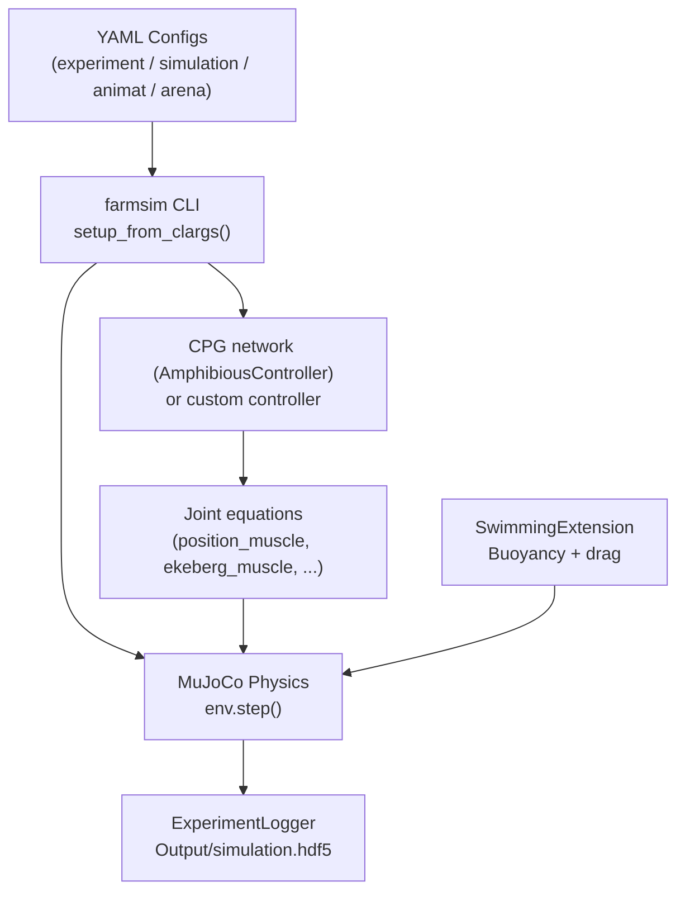

# Zbot: an eel-like swimming robot

!!! abstract "Project page"
    This page belongs to the [Zbot project](index.md), whose repository,
    `farms_zbot`, holds the robot model, the experiments and a Docker
    workspace. The repository is private: ask the maintainers for access.
    Paths such as `experiments/` and `models/` are relative to it. For
    FarmSim itself, start with [Get started](../../get-started/index.md).

The **Zbot** is a bio-inspired, eel-like underwater robot developed for research in swimming locomotion and neural control. It consists of a rigid **Head** module followed by six serially-connected **body segments** (`Segment1` to `Segment6`), connected by six revolute joints (`joint_1` to `joint_6`), and a **TailSegment** fixed to the last segment. Undulation of these joints generates the travelling wave that propels the robot forward.

!!! note "Source Files"
    - `models/zbot/sdf/zbot.sdf`: Zbot SDF model definition
    - `models/zbot/sdf/meshes/`: Visual mesh files (.stl)
    - `experiments/zbot_swimming/`: swimming with the built-in `AmphibiousController` (CPG network)
    - `experiments/zbot_bout_glide/`: bout-and-glide swimming with the custom `ZbotCPGController`
    - `experiments/zbot_bout_glide_teleop/`: the same controller with keyboard teleoperation
    - `experiments/zbot_path_planning/`: path following

This section covers everything you need to:

- Understand the robot's physical model and SDF definition
- Run the built-in swimming experiment
- Implement your own custom controller, including a CPG-based one

---

## Zbot at a Glance

```
Head → [joint_1] → Segment1 → [joint_2] → Segment2 → [joint_3]
     → Segment3 → [joint_4] → Segment4 → [joint_5] → Segment5
     → [joint_6] → Segment6 → [tail_joint, fixed] → TailSegment
```

| Property | Value |
|----------|-------|
| Number of body links | 8 (Head + 6 Segments + TailSegment) |
| Number of revolute joints | 6 (`joint_1` to `joint_6`) |
| Head mass | 1.9 kg |
| Segment mass | ~0.16 kg each |
| Link `density` option | 950 kg/m³ (only used by the legacy buoyancy ramp, see [Zbot Model](model.md#head)) |
| Locomotion mode | Anguilliform undulation (eel-like) |
| Gait frequency | `zbot_swimming`: set by the CPG drive (`frequency_gain` times drive); `zbot_bout_glide`: `tail_frequency` (1 Hz) |
| Physics backend | MuJoCo |
| Hydrodynamics | Buoyancy (exact centre of buoyancy) and drag via `SwimmingExtension` |

---

## Section Contents

| Page | What you will learn |
|------|---------------------|
| [Zbot Model](model.md) | SDF structure, link geometry, inertia, mesh files |
| [Swimming Experiment](experiment.md) | All four YAML config files explained with real values |
| [Custom CPG Controller](custom-controller.md) | Step-by-step guide to implement a CPG from scratch |

---

## How to Read This Section

If you are implementing a custom CPG controller, follow this order. Do not skip ahead: each step builds on the previous one.

**Step 1: this page** *(you are here)*
Get oriented. Understand the robot anatomy, the system diagram, and what each page covers.

**Step 2: [Swimming Experiment](experiment.md)**
Read the YAML configs carefully before writing any Python. You need to understand how the animat `extensions`, `equation`, `motors`, and `loaders` interact; most bugs come from misconfigured YAML, not the controller code itself.

**Step 3: [`AnimatController` API](../../reference/core/core-control.md)**
Study the base class contract: constructor arguments, `from_options()`, `positions()`, `torques()`, and the `ControlType` enum. This is what your class must implement.

**Step 4: [Custom CPG Controller](custom-controller.md)**
Now implement. Follow Steps 1 to 4 in that guide (simple sine CPG) and get it running before touching the ODE version.

---

*Only continue below once your controller is running.*

---

**Step 5: [`Sensor Data Arrays` API](../../reference/core/core-sensors.md)**
Read this when you are ready to add closed-loop sensor feedback. It documents what is inside `sensors.joints`, `sensors.links`, `sensors.xfrc`, and which `sc.*` index maps to each channel.

**Step 6: [Mathematical Models](../../explanation/mathematical-models.md)**
Go here if your CPG behaviour does not match expectations. It has the actual phase/amplitude ODE equations and the Ekeberg torque derivation to reason about frequencies, phase lags, and amplitudes.

---

## Quick-Start

### Enter the container and run the default experiment

```bash
docker exec -it zbot_farms_linux bash   # zbot_farms_windows on Windows
cd /app/experiments/zbot_swimming
farmsim --experiment_config experiment_config.yaml
```

The MuJoCo viewer opens automatically. Press **Space** to pause and resume.

### Run headless (no viewer)

There is no command line flag for this: set `runtime.headless: true` in the
experiment's `simulation_config.yaml` (as `zbot_bout_glide` does).

### Analyse results

```bash
python analysis.py
```

The analysis script plots the results saved in `Output/simulation.hdf5` by
the `ExperimentLogger` extension.

---

## How the Pieces Connect



!!! tip "Don't Skip The YAML"
    The most common mistake is jumping straight to [Custom CPG Controller](custom-controller.md) without reading [Swimming Experiment](experiment.md) first. You need to understand the YAML wiring before the Python makes sense.

---

## Zbot terms

Terms specific to the Zbot controllers. The FarmSim terms are in the
[glossary](../../help/glossary.md).

**SegmentalCPG**
A self-contained, lightweight Central Pattern Generator implementation used in the Zbot bout-and-glide experiment. It consists of phase oscillators arranged in segments, replacing the full FARMS oscillator network for simpler undulatory control.
*Implementation*: `experiments/zbot_bout_glide/controller/zbot_controller.py`

**vSPN**
Vestibulospinal-like neuron drive. In the Zbot controller, it acts as an envelope signal (modeled as an exponential filter) that modulates the amplitude of the CPG outputs to create the "bout" phase of the bout-and-glide swimming pattern.
*Implementation*: `experiments/zbot_bout_glide/controller/zbot_controller.py`

**ZbotCPGController**
A custom CPG controller for the Zbot robot that implements a bout-and-glide swimming pattern. Extends `AnimatController` and uses a self-contained `SegmentalCPG`.
*Implementation*: `experiments/zbot_bout_glide/controller/zbot_controller.py`

---

## See Also

- [Installation Guide](install.md): get the Docker container running
- [Architecture Overview](../../explanation/architecture.md): full system data-flow diagram
- [Mathematical Models](../../explanation/mathematical-models.md): CPG ODEs and Ekeberg muscle equations
- [`AnimatController` API](../../reference/core/core-control.md): base class reference
- [`AmphibiousController` API](../../reference/amphibious/amphibious-controller.md): production CPG controller
