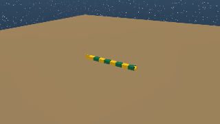

# Your first simulation

!!! info "Tutorial overview"
    - **Goal**: run the AmphiBot example, control the viewer, and find the
      files the simulation writes.
    - **Level**: beginner
    - **Time**: 15 minutes
    - **Prerequisites**: FarmSim [installed](../get-started/installation.md)
      (Docker container or virtual environment)

## Background

An experiment is a folder with a run script and YAML files that describe
the simulation, the robot (the *animat*) and the world (the *arena*).
The AmphiBot example, in `examples/amphibot/` of the farmsim_docs
repository, has two experiments:

| Experiment file | Controller |
|---|---|
| `experiment_config.yaml` | The built-in CPG network of `farms_amphibious` |
| `experiment_config_wave.yaml` | A custom travelling-wave controller, written in [tutorial 4](custom-controller.md) |

This tutorial runs the first one.

## Step 1: Run the simulation

In the Docker container, or with your virtual environment activated:

```bash
cd examples/amphibot
python run_sim.py --experiment_config experiment_config.yaml
```

The `farmsim` command, installed by `farms_sim`, does the same:

```bash
farmsim --experiment_config experiment_config.yaml
```

The MuJoCo viewer opens. AmphiBot starts on land, facing the pool. Its
central pattern generator sends a travelling wave down the body: the
joints undulate from head to tail, the wheels under the segments roll
along the body and grip sideways, and the robot crawls forward. It rolls
down the ramp, floats when it reaches the water, and swims.



The simulation lasts 10 s of simulated time (`runtime.n_iterations` steps
of `physics.timestep`, in `simulation_config.yaml`), then the viewer
closes and the data is saved.

## Step 2: Control the viewer

| Key or mouse | Action |
|---|---|
| `Space` | Pause and resume |
| `Right arrow` | Advance one step while paused |
| `+` / `-` | Double or halve the playback speed |
| `Q` | Quit |
| Left drag | Rotate the camera |
| Right drag | Move the camera |
| Scroll | Zoom |

The camera follows the robot (the `CameraFollower` extension of
`simulation_config.yaml`). Double-click a body to select it, and use the
viewer's left panel to show contact points, forces or the collision
geometry.

## Step 3: Run without a window

For servers, scripts and parameter sweeps, run headless: no viewer, as fast
as possible. In `simulation_config.yaml`, set:

```yaml
# check-docs: skip
runtime:
  headless: true
```

and run the same command. A progress bar shows the simulated time. The
results are identical to the interactive run.

## Step 4: Find the output

The loggers listed under `extensions:` in `simulation_config.yaml` write to
`Output/`:

| File | Written by | Content |
|---|---|---|
| `Output/simulation.hdf5` | `ExperimentLogger`, at the end | Every sensor at every step: link poses and velocities, joint positions and torques, external forces, CPG states |
| `Output/simulation_options.yaml`, `Output/animat_0_options.yaml`, `Output/arena_0_options.yaml` | `ExperimentOptionsLogger`, at the start | The options as resolved by FarmSim |
| `Output/simulation_mjcf.xml` | `MjcfSaver`, at the start | The MuJoCo model built from the SDF files |

Check the head position at the end of the run:

```python
import h5py

with h5py.File('Output/simulation.hdf5', 'r') as data:
    links = data['FARMSLISTanimats/0/sensors/links/array'][()]
    print('Final head position [m]:', links[-1, 0, 0:3])
```

The head started at x = -1 m and should end past x = 1 m, in the pool.
[Tutorial 6](record-and-plot.md) loads this file properly.

The MuJoCo model is a normal MJCF file. You can open it in MuJoCo's own
viewer to inspect it: `python -m mujoco.viewer --mjcf Output/simulation_mjcf.xml`.

## Step 5: Try the custom controller

```bash
python run_sim.py --experiment_config experiment_config_wave.yaml
```

Same robot and arena, different controller: a hand-written travelling wave
that uses a slower, wider gait on land and switches to a swimming gait
when the head enters the water. You will write it in
[tutorial 4](custom-controller.md).

## Summary

- An experiment is a folder with a `run_sim.py` and YAML files, run with
  `python run_sim.py --experiment_config experiment_config.yaml`.
- The viewer can be paused, stepped and sped up; `runtime.headless: true`
  runs without it.
- The results are in `Output/`: an HDF5 log, the resolved options and the
  MuJoCo model.

## Next steps

- [Tutorial 2: Understand the experiment files](experiment-files.md)
- [Troubleshooting](../help/troubleshooting.md) if the viewer does not
  open or the simulation fails
