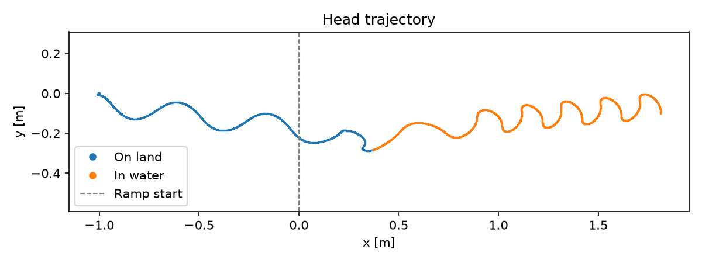
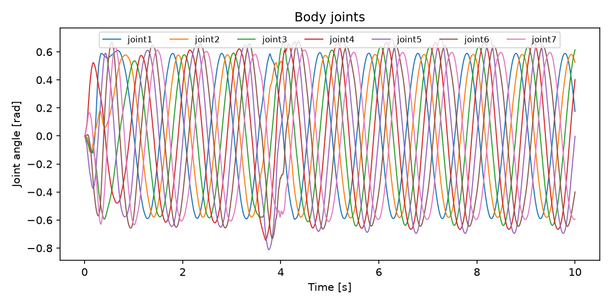
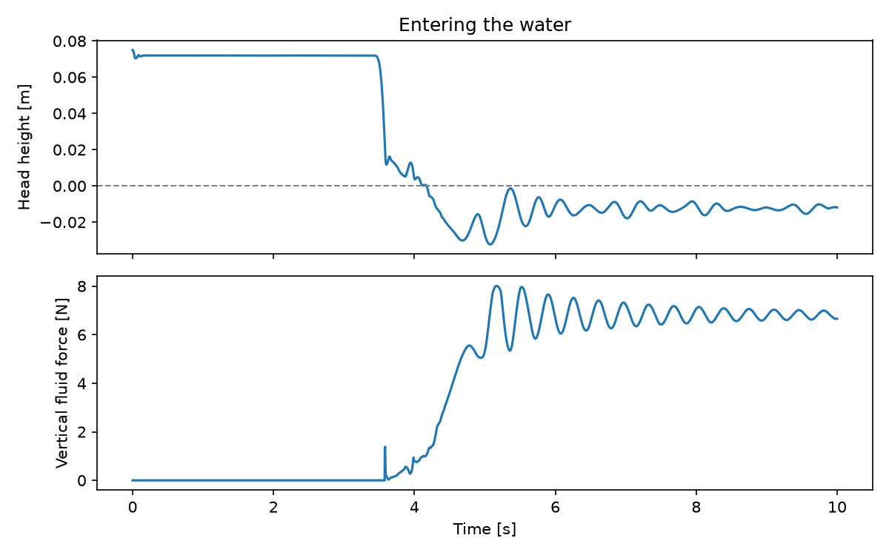

# Record, load and plot data

!!! info "Tutorial overview"
    - **Goal**: load the HDF5 log of a run, read link, joint and force
      sensors, and plot the trajectory, the travelling wave and the water
      entry.
    - **Level**: beginner
    - **Time**: 30 minutes
    - **Prerequisites**: [Your first simulation](first-simulation.md);
      NumPy and Matplotlib basics

## Background

`ExperimentLogger` saves every sensor at every step to
`Output/simulation.hdf5` at the end of the run. The arrays have one row
per iteration and one column per quantity, in an order fixed by the
*sensor convention* `sc` (`farms_core.sensors.sensor_convention`), so you
never index columns by hand. The finished script of this tutorial is
`examples/amphibot/plot_run.py`.

## Step 1: Record a full run

Run the CPG experiment to the end (10 s), headless or not:

```bash
cd examples/amphibot
python run_sim.py --experiment_config experiment_config.yaml
```

`runtime.buffer_size` must be at least `runtime.n_iterations` to keep the
whole run: the logger saves the last `buffer_size` iterations.

## Step 2: Load the data

```python
import numpy as np
from farms_core.experiment.data import ExperimentData
from farms_core.sensors.sensor_convention import sc

data = ExperimentData.from_file('Output/simulation.hdf5')
times = np.asarray(data.times)
links = data.animats[0].sensors.links
joints = data.animats[0].sensors.joints
xfrc = data.animats[0].sensors.xfrc
print(len(times), 'iterations')
print(list(links.names))
print(list(joints.names))
```

`links.names` lists the 16 links (head, seven segments and eight wheels),
`joints.names` the 15 joints (seven body joints, then the wheels).

## Step 3: Read the sensors

```python
links_names = list(links.names)
joints_names = list(joints.names)

# Centre of mass of each link: (iterations, links, 3) [m]
com = np.asarray(links.array)[:, :, sc.link_com_position_x:sc.link_com_position_z+1]
# Joint angles: (iterations, joints) [rad]
positions = np.asarray(joints.array)[:, :, sc.joint_position]
# External forces on each link, including the water: (iterations, links, 3) [N]
forces = np.asarray(xfrc.array)[:, :, sc.xfrc_force_x:sc.xfrc_force_z+1]

head = com[:, links_names.index('head')]
in_water = head[:, 2] < 0  # Below the water surface
```

The [sensors reference](../reference/core/core-sensors.md) lists every
column of the link, joint, contact and force arrays.

## Step 4: Speeds on land and in water

```python
speed = np.gradient(head[:, 0], times)  # Head velocity along x [m/s]
print(f'On land:  {speed[~in_water].mean():.2f} m/s')
print(f'In water: {speed[in_water].mean():.2f} m/s')
```

With the built-in CPG, AmphiBot crawls at about 0.3 m/s and swims at about
0.25 m/s.

## Step 5: Plot

The trajectory seen from above:

```python
import matplotlib.pyplot as plt

fig, ax = plt.subplots(figsize=(8, 3))
ax.plot(head[~in_water, 0], head[~in_water, 1], '.', ms=1, label='On land')
ax.plot(head[in_water, 0], head[in_water, 1], '.', ms=1, label='In water')
ax.set_xlabel('x [m]')
ax.set_ylabel('y [m]')
ax.legend(markerscale=10)
ax.set_aspect('equal', adjustable='datalim')
fig.savefig('trajectory.png', dpi=150)
```



The body joints show the travelling wave: each joint follows the previous
one with a constant phase lag.

```python
fig, ax = plt.subplots(figsize=(8, 4))
for i in range(1, 8):
    ax.plot(times, positions[:, joints_names.index(f'joint{i}')], lw=1, label=f'joint{i}')
ax.set_xlabel('Time [s]')
ax.set_ylabel('Joint angle [rad]')
ax.legend(ncol=7, fontsize='small')
fig.savefig('joints.png', dpi=150)
```



The head height and the vertical water force on the body show the water
entry: the force is zero on land, then rises until it balances the
robot's weight.



Run the complete script to produce the three figures in `Output/plots/`:

```bash
python plot_run.py
```

## Step 6: Load the options of a run

The resolved options of the run are saved next to the data, and load with
their classes:

```python
from farms_core.simulation.options import SimulationOptions
from farms_amphibious.model.options import AmphibiousOptions

simulation = SimulationOptions.load('Output/simulation_options.yaml')
animat = AmphibiousOptions.load('Output/animat_0_options.yaml')
print(simulation.physics.timestep, len(animat.control.network.oscillators))
```

Keeping the options with the data means every result can be traced back to
the exact configuration that produced it.

## Summary

- `ExperimentData.from_file()` loads the log; the sensors are arrays of
  shape (iterations, items, columns).
- The sensor convention `sc` gives the columns: `sc.link_com_position_x`,
  `sc.joint_position`, `sc.xfrc_force_x` and many more.
- The options saved in `Output/` load back with their classes.

## Next steps

- [Save, load and inspect data (how-to)](../how-to/save-load-data.md): the
  HDF5 structure and the CPG state
- [Add and configure sensors](../how-to/configure-sensors.md)
- [Bring your own robot](../how-to/own-robot.md)
