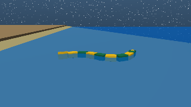

# Swimming and buoyancy

!!! info "Tutorial overview"
    - **Goal**: configure the water, see what buoyancy and drag do to
      AmphiBot, and choose between the fluid models.
    - **Level**: intermediate
    - **Time**: 30 minutes
    - **Prerequisites**: [Understand the experiment files](experiment-files.md)

## Background

FarmSim does not simulate the water as a fluid. Each link with
`fluid_interaction: true` gets forces computed from its pose and velocity
relative to a water half-space below `water.height`:

| Force | What it depends on | Options |
|---|---|---|
| Buoyancy | Submerged volume of the link's collision geoms, applied at its centre (the centre of buoyancy, CoB) | `water.buoyancy`, `water.density`, `cob_method` |
| Drag | Link velocity relative to the water | `water.drag`, link `drag_coefficients` (legacy model) or the link shape (ellipsoid model) |
| Added mass | Link acceleration (ellipsoid model only) | `added_mass` |

The `SwimmingExtension` in the animat's `extensions:` computes them in C at
every MuJoCo step. The [mathematical models](../explanation/mathematical-models.md#2-hydrodynamics)
page gives the equations.



## Step 1: Start in the water

To focus on swimming, start AmphiBot in the pool. In `generate_config.py`,
set:

```python
        'spawn_position': [4.5, 0, 0.0],
```

and regenerate:

```bash
python generate_config.py
```

Set `n_iterations: 4001` and `buffer_size: 4001` (4 s) in
`simulation_config.yaml`, and `headless: true` if you compare runs from
the command line. Run the experiment and check the head with the snippet of
[tutorial 1](first-simulation.md#step-4-find-the-output). The head moves
about 0.56 m forward and stays about 1 cm below the surface: AmphiBot
floats, because its boxes and wheels displace about 0.93 kg of water for a mass of
0.77 kg (0.73 kg of body and 0.04 kg of wheels).

## Step 2: Buoyancy

In `arena_config.yaml`, turn buoyancy off:

```yaml
# check-docs: skip
water:
  buoyancy: false
```

AmphiBot sinks to the pool floor (z = -0.58 m) and crawls along it on its
wheels. With buoyancy on, the force on each link is $\rho V g$ at the
centre of buoyancy, where $V$ is the submerged volume of the link's
collision geoms. `cob_method` chooses how $V$ and its centre are computed:

| `cob_method` | How | Cost | Use |
|---|---|---|---|
| `exact` (default) | Closed forms for spheres, ellipsoids, cylinders and capsules; boxes and meshes clipped at the waterline | Grows with the number of geoms | Accuracy, few geoms per link |
| `lut` | Lookup table per link, built once at load time | O(1) per link (about 60 ns) | Many geoms per link, overlapping geoms, large batches of simulations |
| `ramp` | Legacy ramp based on the link mass and density | Lowest | Compatibility with old configurations |

Set buoyancy back on and try the lookup tables:

```yaml
# check-docs: skip
water:
  buoyancy: true
  cob_method: lut
```

The trajectory is the same as with `exact` to the millimetre: AmphiBot's
links are boxes, which `exact` already handles in closed form, and the
tables are sampled from the same kernels. The tables are built at the
first run and saved in `cob_lut_cache/`, next to `run_sim.py`. The
following runs, and the other experiments of the folder, load them from
there. `cob_lut_cache: <dir>` in the `water` block, or the
`FARMS_COB_LUT_CACHE` environment variable, choose another directory, and
`cob_lut_cache: false` keeps the tables in memory only.

## Step 3: A water current

The water velocity is relative to the world. Set a current against the
direction of swimming:

```yaml
# check-docs: skip
water:
  velocity: [-0.15, 0, 0]  # [m/s]
```

The head now moves about 0.07 m in 4 s instead of 0.56 m: the current
almost cancels AmphiBot's swimming speed (about 0.14 m/s). `velocity` can
also point to velocity maps (`maps`), see the
[swimming reference](../reference/mujoco/mujoco-swimming.md).

## Step 4: Drag coefficients

With the default `fluid_model: legacy`, each link's drag is quadratic in
its velocity, per axis of the link frame, with the coefficients of the
animat file:

```yaml
# check-docs: skip
morphology:
  links:
  - name: seg7
    drag_coefficients:
    - [-0.25, -3.0, -1.8]  # Linear: along the body, sideways, vertical
    - [0, 0, 0]            # Angular
```

Thrust comes from the difference between the sideways and the axial drag:
the travelling wave pushes the water backward with the sides of the
segments, while the body slides forward along its axis. In
`generate_config.py`, try:

- `DRAG_BODY` and `DRAG_TAIL` both `[[-1.5, -1.5, -1.8], [0, 0, 0]]`
  (same drag along the body and sideways): the head moves about 0.05 m in
  4 s instead of 0.56 m, the thrust mostly disappears.
- A larger tail coefficient in `DRAG_TAIL`: the tail, the segment with the
  largest swing, pushes harder.

Regenerate and rerun after each change.

## Step 5: The ellipsoid model

The ellipsoid model computes the drag from the shape instead of
coefficients: each link is approximated by an ellipsoid, with form,
viscous and rotational drag, and optionally Lamb's added mass:

```yaml
# check-docs: skip
water:
  fluid_model: ellipsoid
  added_mass: implicit
```

With AmphiBot, this model gives almost no thrust (the head drifts by about
-0.1 m in 4 s with added mass, and moves 0.01 m without). Its segments are
short boxes (0.068 by 0.045 by 0.035 m), so their fitted ellipsoids have a
sideways drag only about 1.5 times the axial one, against 6 times with the
coefficients above, and the tail fin is a visual shape, ignored by the
fluid model. The legacy model's coefficients encode
the fin and the anisotropy explicitly. Use the ellipsoid model for bodies
whose shape carries the hydrodynamics (elongated, fish-like links), and
tune `ellipsoid_coefficients` against data.

## Summary

- Fluid forces are per link, below `water.height`, from the
  `SwimmingExtension`.
- Buoyancy uses the submerged volume of the collision geoms;
  `cob_method: lut` precomputes it in tables cached next to the script.
- `water.velocity` adds a current; `drag_coefficients` set the legacy
  drag, whose anisotropy produces the swimming thrust.
- The ellipsoid model derives drag and added mass from the link shapes.

## Next steps

- [Tutorial 6: Record, load and plot data](record-and-plot.md)
- [Swimming reference](../reference/mujoco/mujoco-swimming.md): every
  option
- [Hydrodynamics internals](../internals/hydrodynamics-internals.md): how
  the forces are computed
