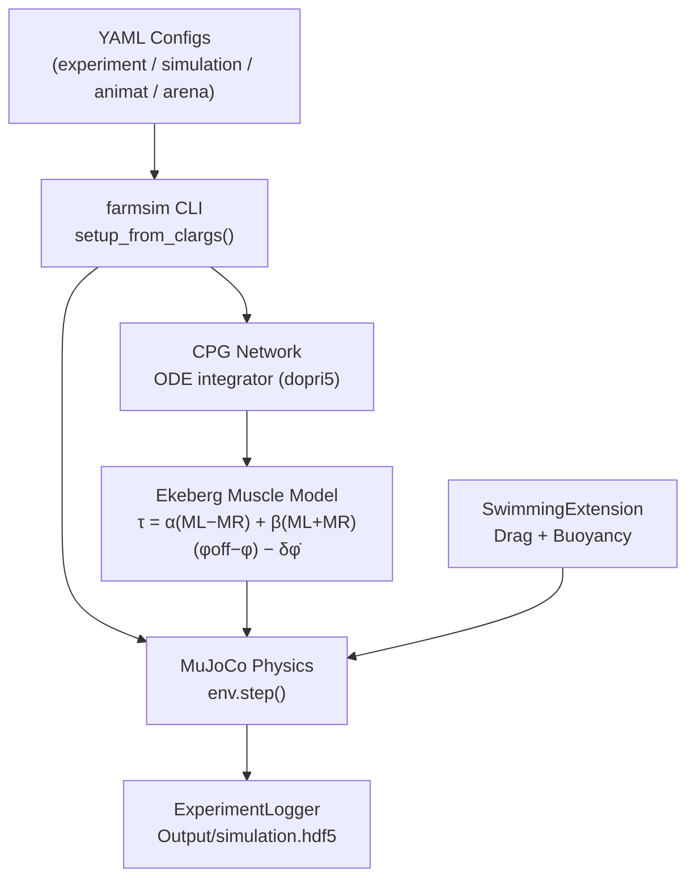

# Zbot

The **Zbot** is a bio-inspired, eel-like underwater robot developed for research in swimming locomotion and neural control. It consists of a rigid **Head** module followed by six serially-connected **body segments** (`Segment1`–`Segment6`) and a **TailSegment**, connected by six revolute joints (`joint_1`–`joint_6`). Sinusoidal undulation of these joints generates the travelling wave that propels the robot forward.

This section covers everything you need to:

- Understand the robot's physical model and SDF definition
- Run the built-in swimming experiment
- Implement your own custom controller — including a CPG-based one

---

## Zbot at a Glance

```
Head → [joint_1] → Segment1 → [joint_2] → Segment2 → [joint_3]
     → Segment3 → [joint_4] → Segment4 → [joint_5] → Segment5
     → [joint_6] → Segment6 → TailSegment
```

| Property | Value |
|----------|-------|
| Number of body links | 8 (Head + 6 Segments + TailSegment) |
| Number of revolute joints | 6 (`joint_1` – `joint_6`) |
| Head mass | 1.9 kg |
| Segment mass | ~0.16 kg each |
| Link density | 950 kg/m³ (less than water → floats) |
| Locomotion mode | Anguilliform undulation (eel-like) |
| Default gait frequency | ~0.5 Hz (CPG: `frequency_gain` × drive) |
| Physics backend | MuJoCo (default) |
| Hydrodynamics | Drag + buoyancy via `SwimmingExtension` |

---

## Section Contents

| Page | What you will learn |
|------|---------------------|
| [Zbot Model](model.md) | SDF structure, link geometry, inertia, mesh files |
| [Swimming Experiment](experiment.md) | All four YAML config files explained with real values |
| [Custom CPG Controller](cpg_controller.md) | Step-by-step guide to implement a CPG from scratch |

---

## How to Read This Section

If you are implementing a custom CPG controller, follow this order. Do not skip ahead — each step builds on the previous one.

**Step 1 — This page** *(you are here)*
Get oriented. Understand the robot anatomy, the system diagram, and what each page covers.

**Step 2 — [Swimming Experiment](experiment.md)**
Read the YAML configs carefully before writing any Python. You need to understand how `controller_loader`, `equation`, `motors`, and `loaders` interact — most bugs come from misconfigured YAML, not the controller code itself.

**Step 3 — [`AnimatController` API](../api/farms_core_control.md)**
Study the base class contract: constructor arguments, `from_options()`, `positions()`, `torques()`, and the `ControlType` enum. This is what your class must implement.

**Step 4 — [Custom CPG Controller](cpg_controller.md)**
Now implement. Follow Steps 1–4 in that guide (simple sine CPG) and get it running before touching the ODE version.

---

*Only continue below once your controller is running.*

---

**Step 5 — [`Sensor Data Arrays` API](../api/farms_core_sensors.md)**
Read this when you are ready to add closed-loop sensor feedback. It documents what is inside `sensors.joints`, `sensors.links`, `sensors.xfrc`, and which `sc.*` index maps to each channel.

**Step 6 — [Mathematical Models](../mathematical_models.md)**
Go here if your CPG behaviour does not match expectations. It has the actual phase/amplitude ODE equations and the Ekeberg torque derivation to reason about frequencies, phase lags, and amplitudes.

---

## Quick-Start

### 1 — Enter the container and run the default experiment

```bash
docker exec -it farms_zbot bash
cd /app/experiments/zbot_swimming
farmsim --experiment_config experiment_config.yaml
```

The MuJoCo viewer opens automatically. Press **Space** to pause/unpause.

### 2 — Run headless (no viewer)

```bash
farmsim --experiment_config experiment_config.yaml --headless
```

### 3 — Analyse results

```bash
python analysis.py
```

Plots of joint positions, velocities, and torques are generated from `Output/simulation.hdf5`.

---

## How the Pieces Connect



!!! tip "Don't skip the YAML"
    The most common mistake is jumping straight to [Custom CPG Controller](cpg_controller.md) without reading [Swimming Experiment](experiment.md) first. You need to understand the YAML wiring before the Python makes sense.

---

## See Also

- [Installation Guide](../installation.md) — get the Docker container running
- [Architecture Overview](../architecture.md) — full system data-flow diagram
- [Mathematical Models](../mathematical_models.md) — CPG ODEs and Ekeberg muscle equations
- [`AnimatController` API](../api/farms_core_control.md) — base class reference
- [`AmphibiousController` API](../api/farms_amphibious_controller.md) — production CPG controller
